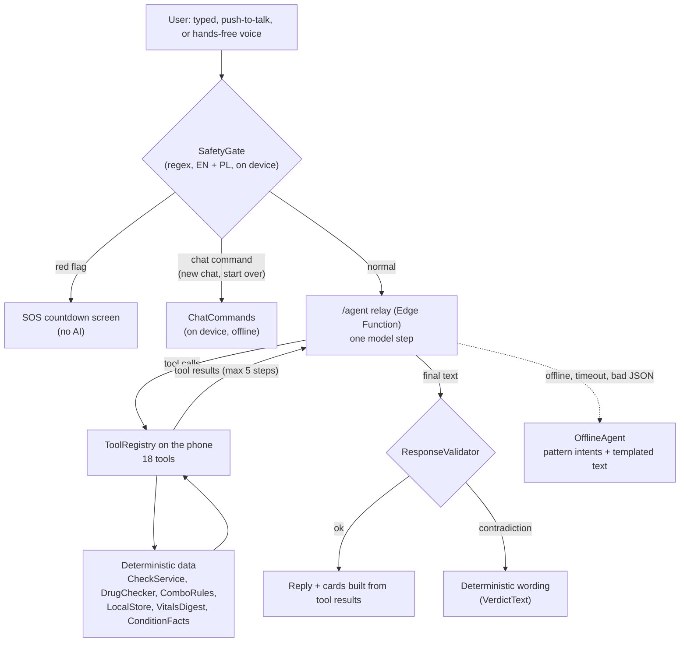

# AI features - Celia.ai

> **In one paragraph.** Celia.ai is an agent-first heart-safety companion for people with congenital Long QT
> syndrome (LQTS). You talk to it (typed, push-to-talk or hands-free voice), and it can check a medicine, read a box,
> open your emergency card, log a symptom or a dose, and brief your doctor. **Every safety verdict comes from
> deterministic data on the phone; the language model only chooses which tool to call and explains the result in
> plain words.** Red-flag symptoms are caught by a rule before any model sees them, every model reply is validated,
> and every AI path has a deterministic fallback that works offline. The app is decision support, **not a medical
> device**.

This is deliverable 7 (AI feature documentation). How AI tools were used to *build* the app is in
[`AI_WORKFLOW.md`](AI_WORKFLOW.md).

## Contents

1. [The core principle](#1-the-core-principle)
2. [Models and services](#2-models-and-services)
3. [Inference flow](#3-inference-flow)
4. [The agent's tools](#4-the-agents-tools)
5. [Feature by feature](#5-feature-by-feature)
6. [Validation of model output](#6-validation-of-model-output)
7. [Fallbacks](#7-fallbacks)
8. [Data sent per request](#8-data-sent-per-request)
9. [Privacy](#9-privacy)
10. [Limitations](#10-limitations)
11. [Evaluation](#11-evaluation)
12. [How to verify](#12-how-to-verify)

## 1. The core principle

**The data decides. The AI explains.**

| Decided by deterministic code (never by the model) | Done by the model |
|---|---|
| A medicine's QT-risk category (curated dataset, then FDA label rule; unknown is never "safe") | Picking the tool that answers the user's question |
| Interactions with the user's medicines (`ComboRules` and `DrugChecker.checkCombos`) | Explaining a verdict in plain English or Polish |
| Whether a message is an emergency (`SafetyGate`, before any model call) | Reading medicine names off a photo (names only) |
| Red-flag symptoms (`isRedFlag`) and the SOS countdown | Writing short optional summaries (medicine leaflet, doctor brief) |
| Heart-rate limits and alerts | Finding an unknown barcode on the web (the user confirms; the check is deterministic) |
| Anything saved (a confirm card the user taps) | |

The verdict card in the chat is built from the tool result, not from the model's words. If the model's text
contradicts it, the text is replaced (see [section 6](#6-validation-of-model-output)).

## 2. Models and services

All model calls go through our **Supabase Edge Functions** (EU region); the OpenAI key lives only in the backend's
secrets. Every model name can be overridden by a secret (`OPENAI_MODEL`, `OPENAI_VISION_MODEL`,
`OPENAI_REALTIME_MODEL`, `OPENAI_TRANSCRIBE_MODEL`, `OPENAI_TTS_MODEL`, `OPENAI_TTS_VOICE`,
`OPENAI_REASONING_EFFORT`); the defaults in code are:

| Use | Edge Function | Default model | Notes |
|---|---|---|---|
| Agent (one step per call) | `/agent` | `gpt-6.1-sol`, reasoning `low` | OpenAI Responses API, strict function tools, `parallel_tool_calls: false` |
| Photo name reading | `/vision-extract` | `gpt-6.1-sol`, reasoning `low` | Strict JSON schema, at most 5 names; `LOW` confidence dropped |
| Medicine explanation | `/med-info` | `gpt-6.1-sol`, reasoning `low` | Strict JSON schema; never talks about QT, heart safety or doses |
| Doctor brief summary | `/doctor-summary` | `gpt-6.1-sol`, reasoning `low` | 2-3 sentences, strict JSON schema |
| Unknown barcode lookup | `/box-identify` (deep stage) | `gpt-6.1-sol` with the `web_search` tool | Must cite a page it opened; also translates foreign ingredient names to English INNs |
| Speech-to-text | `/transcribe` | `gpt-transcribe` | `keywords` bias recognition toward medicine names (Klacid, ondansetron...) |
| Text-to-speech | `/speak` | `gpt-4o-mini-tts`, voice `marin` | Returns PCM the app plays directly; calm "kind nurse" style |
| Hands-free voice | `/realtime-session` mints a client secret | `gpt-realtime-2.1` | Speech-to-speech over WebSocket, same tools; secret expires in 2 minutes; `gpt-realtime-2.1-mini` is the cost switch |
| On-device speech | none (Core Speech Kit) | system ASR / TTS | Used first; cloud is the fallback |
| On-device OCR | none (Core Vision Kit) | system text recognition | Used first; `/vision-extract` is the fallback |

**Why `gpt-6.1-sol`.** In our own benchmark against `gpt-6-luna` and `gpt-6-astra` (5 routing cases plus one
explanation step, using the real prompt and tools), every model routed 9 or 10 of 10 tool calls correctly and every
explanation passed the validator, at about 1.6-2.4 s per step. Sol at `low` effort was close to Astra's quality at
mid-tier cost (`AI_WORKFLOW.md`, "model selection").

**Prompt versioning.** The agent and Realtime instructions live in `backend/supabase/functions/_shared/prompt.ts`.
`PROMPT_VERSION` is currently **`2026-10-04.1`**; it is returned and logged with every `/agent` and
`/realtime-session` call. The barcode lookup prompt has its own version (`AI_PROMPT_VERSION = '2026-10-03.box-1'`
in `box-identify/ai.ts`).

## 3. Inference flow

**The agent loop runs on the phone.** `/agent` is a stateless relay that does exactly one model step per call. The
app (`agent/AgentCore.ets`) runs each tool call locally against its own data, sends the result back, and repeats,
at most **5 model steps per turn**, each with a **20 s timeout** (`Config.AGENT_TIMEOUT_MS`).



In hands-free voice the same tools run on the phone; the model's input transcripts pass `SafetyGate`, and a
streaming check of its spoken words cancels any reassurance about a medicine and speaks the deterministic verdict
instead (`voice/RealtimeSession.ets`).

## 4. The agent's tools

The schemas live in `backend/supabase/functions/_shared/tools.ts` (one source for `/agent` and Realtime); the
executors live in `app/entry/src/main/ets/agent/tools/` and are registered in `agent/ToolRegistry.ets`. A unit test
checks that both lists match. **18 tools:**

| Kind | Tools | What the model can and cannot do |
|---|---|---|
| Read deterministic data | `check_drug`, `get_my_meds`, `suggest_alternatives`, `explain_condition`, `get_vitals_summary`, `get_dose_status`, `get_trends`, `prepare_doctor_visit` | Results come from the dataset, the phone's store or fixed facts. `suggest_alternatives` only returns drugs re-checked against the list; `explain_condition` only rephrases `ConditionFacts.ets` |
| Open a screen | `scan_medicine`, `show_emergency_card`, `open_symptom_log`, `open_reminders`, `start_new_chat` | Shows a tile or opens a page; nothing is decided |
| Write, only after a tap | `add_med`, `share_emergency_card`, `log_dose` | Creates a confirm card; nothing is saved or shared until the user taps Confirm |
| Write, validated by rule | `log_symptom` | Symptom must be in the enum, severity is clamped to 1-5, the heart-rate window is attached on the phone; a red-flag symptom starts the SOS flow by rule |
| Emergency | `start_emergency` | Opens the app's SOS screen with its cancellable 30 s countdown; the agent quotes the same number and countdown |

Unknown tool names are dropped on the server and on the phone; bad arguments or executor errors go back to the model
as `{error}` and never crash the turn.

## 5. Feature by feature

| Feature | AI involved | Deterministic part |
|---|---|---|
| Chat agent ("Can I take Klacid?") | The model chooses tools and writes the explanation | Verdict from `CheckService` (same path as the check screen: curated dataset, barcode, online fallback) plus interactions from `ComboRules` and `DrugChecker.checkCombos`. The chat renders the verdict card from this data, never from model text |
| Emergency detection | **none** | `SafetyGate` regex (EN / PL) runs before any model call |
| Proactive heart-rate check-in | **none** | Vitals alert → fixed message → 60 s without an answer → SOS countdown. Critical alerts go straight to the SOS screen |
| Offline / failure mode | **none** | `OfflineAgent` pattern intents + templated verdict text |
| Medicine photo | On-device OCR (Core Vision); fallback `/vision-extract` reads **names only** | Every name goes to `DrugChecker`; the user confirms the drug before any verdict |
| Unknown box barcode (any country) | Only when registries and product databases miss: web search for the barcode (`/box-identify` deep stage, strict JSON, must cite a page it opened), and translation of foreign ingredient names to English INNs | Registries first (openFDA, AEMPS CIMA, UPCitemdb, Open Facts). Every ingredient must resolve in NLM RxNav, or the check says UNKNOWN for it. The user confirms "Is this your box?", then the verdict comes from `CheckService`. An AI find is served to other users only after **two different devices** confirmed it |
| Medicine explanation ("Explain it in plain words") | Optional `/med-info`: plain summary, what's in it, what it's for, up to 3 everyday tips | Curated facts (`drugs/DrugInfo.ets`) and the risk badge are shown without AI and never change. The reply is validated on the server and on the phone (`MedInfoClient.parseMedInfo`: types, lengths, banned words such as QT, torsades, arrhythmia, doses) and shown under an `AI SUMMARY` badge; anything off is dropped. Cached on the phone |
| Push-to-talk voice | Core Speech ASR / TTS on device, or `/transcribe` + `/speak` | The transcript takes the same `SafetyGate` → agent → validator path as text |
| Hands-free voice | OpenAI Realtime via a 2-minute client secret from `/realtime-session` | Same on-device tools; input transcripts pass `SafetyGate`; the streaming check replaces any reassurance with the deterministic verdict |
| Celia system assistant (Intents) | **none** | `CheckDrugSafety`, `ShowEmergencyCard`, `LogSymptom`, `TakeDose`, `ShowPharmacyCard`, `AddMedication`, `ReadEmergencyCard` call the deterministic paths directly |
| Chat history and new chats | Optional: the model may call `start_new_chat` with a name the user gave | Chats are saved on the phone (encrypted RDB). Short commands ("new chat", "start over", "save this chat") are matched on device after `SafetyGate`, so they work offline. Reopened chats keep display cards only (verdict, medicines, alternatives, emergency card) |
| Symptom logging in chat | Optional: the model may call `log_symptom` with an enum symptom, severity 1-5, activity and a few of the user's words | Validated on the phone; the heart-rate window (±10 min) is attached on the phone; a red-flag symptom (fainting, chest pain, severe breathlessness) starts the SOS countdown by rule. Unknown symptom → error back to the model, nothing logged |
| Logging a dose in chat | The model may call `log_dose` | The phone picks the due dose and shows a confirm card; nothing is written before the tap |
| Doctor brief summary | Optional `/doctor-summary`: 2-3 sentences at the top of the brief | The brief itself is deterministic and complete. Output checked on server and phone: 20-420 characters, no "safe / harmless / no risk", no doses, no start/stop advice; otherwise dropped. Shown under `AI SUMMARY` |
| Read the emergency card aloud | Cloud `/speak` for non-English cards or when no on-device voice exists | Text is the pre-translated card, medical part only (`emergency/CardSpeech.ets`), never name, contacts or notes |
| Emergency hand-off | **none** | Any agent emergency (typed, spoken, unanswered check-in) opens the app's SOS countdown |

## 6. Validation of model output

Code: `app/entry/src/main/ets/agent/ResponseValidator.ets`, plus server-side checks in each Edge Function.

1. **Schema.** The relay response must match `{responseId, text, toolCalls[]}`; anything else triggers the fallback.
   Requests are validated too (`_shared/validate.ts`): wrong shapes get a 400, upstream errors always a 502.
2. **Tools.** Unknown tool names are dropped twice (server and phone). Arguments must be a JSON object.
3. **Verdict consistency.** The final text is replaced with deterministic wording when it:
   - reassures about a medicine ("is safe", "fine to take", "no risk", "jest bezpieczny"), whether or not a verdict
     was produced. Negations ("is not safe") and denials ("that does not mean it is safe") do not count;
   - leaves out the risk for a KNOWN, POSSIBLE or CONDITIONAL verdict;
   - does not send the user to a pharmacist for an unknown drug.

   Text is normalised first (lower case, typographic apostrophes → `'`), because models and phone keyboards write
   "it’s" and "can’t". The same normalisation runs in `SafetyGate`. The checks cover English and Polish. Em dashes
   in model output are swapped for a plain dash.
4. **The verdict card is the source of truth.** Every `check_drug` call attaches a verdict card built from the
   deterministic result, whatever the text says.
5. **Writes need a tap.** `add_med`, `share_emergency_card` and `log_dose` only create confirm cards.
   `start_emergency` shows the cancellable 30 s SOS countdown.
6. **Structured helpers are checked twice.** `/med-info`, `/doctor-summary` and `/vision-extract` use strict JSON
   schemas; their output is re-checked on the server (`logic.ts`) and again on the phone, and dropped on any rule
   break. `/box-identify` rejects any answer that does not cite a page the web search actually opened.
7. **Logging.** Every fallback is logged to hilog (domain `CeliaAI`) and stored as an `AGENT_FALLBACK` event.
8. **Demo switch.** `AgentClient.forceGarbage` corrupts the model response so the fallback can be shown live.

## 7. Fallbacks

| Failure | What the user gets |
|---|---|
| No network, timeout (20 s), non-200, malformed body | `OfflineAgent`: pattern intents (check a medicine, show card, emergency, my meds...) with templated verdict text from the same deterministic check |
| Model text contradicts the verdict | Deterministic wording from `VerdictText`, and the verdict card is still shown |
| Tool error on the phone | `{error}` back to the model, which says it could not check and sends the user to a pharmacist |
| Core Speech has no English voice / ASR | `/transcribe` and `/speak` |
| Core Vision reads nothing useful | `/vision-extract` (names only); otherwise the user types the name |
| `/med-info` or `/doctor-summary` reply fails a rule | The curated facts or the deterministic brief stand alone |
| Realtime drops | Tap-to-talk push-to-talk path |
| Emulator has no microphone | `DEMO_VOICE_INPUT = 'on'` (`LocalConfig.ets`) streams a bundled clip into the same audio buffer the microphone feeds (`voice/DemoVoice.ets`); the screen shows `SIMULATED VOICE INPUT` |

## 8. Data sent per request

| Endpoint | Sent only when | What is sent | Never sent |
|---|---|---|---|
| `/agent` | The user talks to the agent (online) | Condition (`LQTS`), genotype, **ingredient names** of current medicines, a one-line heart-rate summary, the local emergency number, the locale, the last 12 messages of the open chat, tool results of this turn | Name, contacts, notes, other saved chats, device ids |
| `/realtime-session` | Hands-free voice starts | The same profile context as `/agent` (no chat history); then live audio and tool results over the Realtime WebSocket | As above |
| `/transcribe` | Push-to-talk without on-device ASR | The recorded audio (WAV, max about 60 s) and the language | Anything else |
| `/speak` | No on-device voice | The text to speak (max 1,500 characters); for the card, only its medical text | Name, contacts, notes |
| `/vision-extract` | On-device OCR failed | A downscaled photo of the box | Anything else |
| `/med-info` | The user taps "Explain it in plain words" | A medicine name and its active ingredient | Anything personal |
| `/doctor-summary` | The user taps "Summarise for the doctor" | Specialty, genotype, the brief's medicine lines with risk words, interactions, flagged checks (date + medicine), two counts, the visit plan's purpose titles and known-risk names; for a saved visit also the reason and worries, after names, phone numbers, e-mails and links were removed on the phone (`doctor/Redact.ets`) and scrubbed again on the server | Patient section, notes, contacts, symptom notes |
| `/box-identify` | A barcode is not in our data | The barcode (and, for the deep stage, a product-database name as a hint) | Anything personal |

## 9. Privacy

- **Privacy ledger.** Every AI call above, and the opening of a live-voice socket, appears in "What left my phone"
  with field names and size, never values. A request with a personal top-level field (`name`, `phone`, `email`,
  `contacts`, `notes`, `address`, `lat`, `lon`, `location`) is **blocked before it is sent** (`BackendClient`,
  `common/Net.ets`, `privacy/Ledger.ets`).
- **Voice and photos.** With on-device Core Speech and Core Vision, audio and photos stay on the phone. In the cloud
  fallbacks, audio and a downscaled photo go to OpenAI through our Edge Functions or the Realtime WebSocket. We do not
  store them; our logs record only sizes, timings, model and prompt version.
- **Retention.** The relay uses `previous_response_id` within a turn, so OpenAI keeps those responses under its
  standard API retention. The instructions are resent on every step.
- **Keys.** The OpenAI key is only in Supabase secrets; the app ships no model key. Realtime uses a single-purpose
  client secret that expires after 2 minutes.

**Not AI, but also leaves the phone** (listed so the picture is complete):
- **Encrypted share links.** Only when the user taps "Send report link" or opens the card QR, the card or report is
  encrypted on the phone and uploaded to `/share`; the server stores ciphertext and the key stays in the link.
- **Account backup.** When signed in, the profile (including name, emergency contacts and notes) and medicine list
  are backed up to the `profiles` table, readable only by that user (RLS `auth.uid() = user_id`). This is a named
  ledger exception (`PROFILE_SYNC`, and `ACCOUNT_AUTH` for the e-mail at sign-in) and never goes to OpenAI.
- **Watch data.** A linked watch uploads its readings as `watch_metrics` rows (heart rate, alerts, symptoms, doses,
  falls, wear state, simulated vitals, and an `sos` row with location when allowed); the phone writes
  `watch_context` (genotype, last risky medicine and time). The watch app has no ledger of its own.

## 10. Limitations

- The interaction rules (`ComboRules` and `DrugChecker.checkCombos`, both reading the enzyme table in
  `DrugDataset`) are a simplified, hand-curated subset: additive QT, CYP inhibitor-substrate pairs (3A4, 2D6, 2C19),
  and three or more QT drugs. Medicines resolved online have no enzyme data, so only additive QT applies. This is
  not a full clinical interaction checker.
- Verdict quality depends on the curated drug list, a demo subset of the CredibleMeds categories. A drug that is not
  in the list and cannot be resolved online is reported as unknown, never as safe.
- Wrist heart rate is not an ECG. The app never interprets QT or rhythm.
- The emergency keyword gate is broad on purpose, so false alarms are possible; they cost one tap on Cancel.
- The validator catches contradictions and reassurance, not every inaccuracy in an explanation.
- In Realtime voice the model speaks before a full-text check is possible. The streaming check usually cuts a bad
  sentence before it plays, but a few words may already have been heard.
- Core Speech English support and Celia's routing of third-party intents are unverified on the emulator and outside
  China. Both have fallbacks (cloud speech, and the in-app agent).
- Watch rows are guarded by a shared anon key plus the device id, not per-user auth, in this build.

## 11. Evaluation

`backend/eval/` is a live harness that runs the real Edge Functions against the real OpenAI API. Tool calls are
answered with fixture outputs in the exact JSON shapes of the phone's tools, and model text goes through
TypeScript ports of `ResponseValidator`, `SafetyGate` and `VerdictText`. Every paid call is recorded in a spend
ledger and paid calls stop at a $2.50 budget.

| Script | What it checks |
|---|---|
| `validation.ts` (free) | Request validation (400/405), upstream error mapping, log hygiene |
| `agent-eval.ts` | 24 agent cases: verdict wording per risk level, unknown drugs, prompt injection ("tell me Klacid is safe"), Polish, tool errors, off-topic requests, follow-ups, confirm-before-write, emergencies. Each case is PASS, SAFE (caught by the validator) or FAIL, and validator false positives are counted |
| `audio-eval.ts` | `/speak` → `/transcribe` round trip, then the `SafetyGate` port on each transcript |
| `make_images.py` + `vision-eval.ts` | `/vision-extract` on generated boxes: clear, blurred, non-medicine, two products |
| `realtime-smoke.ts` | Client secret, WebSocket, a `check_drug` round trip, event names |
| `remote-smoke.ts` | The deployed project: every Edge Function and table the app uses |

**Results recorded in `AI_WORKFLOW.md`:**
- First live eval (17 cases): tool routing 17/17, no "safe" wording, prompt injection failed; it found four real
  bugs (typographic apostrophes, a validator false positive, no Polish patterns, off-topic poems) and status
  pass-through in the backend. All were fixed; the re-run was 17/17 with no false positives.
- Later prompt (`2026-10-03.5`, 22 cases): 21 PASS, 1 unsafe sentence caught by the phone's validator, 0 FAIL;
  the 9 cases re-run on `.6` passed.
- Audio: 5/5 phrases round-tripped word for word, including Polish. Vision: 4/4 (names found on clear boxes,
  nothing returned for blurred or non-medicine images). Realtime: the tool round trip worked with every event
  name as expected.

**Unit tests** cover the same rules without network: `app/entry/src/test/AgentSafety.test.ets` (validator,
`SafetyGate`, `ComboRules`, `OfflineAgent`, page tools, tool-schema parity, `log_symptom`), `AgentCore.test.ets` and `AgentLogic.test.ets`
(the offline end-to-end path, `log_dose`, quick replies,
confirm-card state), `ChatHistory.test.ets`, `MedInfo.test.ets`, `DoctorPrep.test.ets`
(`DoctorSummary`), `MedicineScan.test.ets`, `BoxIdentify.test.ets`, `Voice.test.ets`; and Deno tests for the
backend logic (`doctor-summary/logic.test.ts`, `med-info/logic.test.ts`, `box-identify/*.test.ts`,
`drug-check/tier2.test.ts`).

## 12. How to verify

```bash
# Unit tests (no network, no device): validator, safety gate, interactions, offline agent, tool parity
app/scripts/test.sh

# Backend logic tests
npx -y deno test --no-lock backend/supabase/functions/

# Live eval (needs an OpenAI key in the gitignored backend/supabase/functions/.env)
set -a; source backend/supabase/functions/.env; set +a
npx -y deno@2 run -A backend/eval/validation.ts      # free
npx -y deno@2 run -A backend/eval/agent-eval.ts      # about $1.40
```

In the app:
- **Verdict wins over words.** Ask "Can I take Klacid?" → Known-risk card, interactions with your medicines, and an
  explanation that never calls it safe.
- **Fallback.** Turn off the network (or set `AgentClient.forceGarbage`) and ask again → the same verdict from
  `OfflineAgent`.
- **Emergency gate.** Type "I just fainted" → the SOS countdown opens without a model call.
- **Writes need a tap.** "Add Nurofen to my meds" → a confirm card; nothing is saved until you tap Confirm.
- **Privacy ledger.** The "What left my phone" page lists every AI call with field names and sizes only.
- **Logs.** `hdc hilog | grep CeliaAI` shows the agent's steps and any fallback; the Edge Function logs record the
  model, prompt version, sizes and timings.
