<div align="center">

# Celia.ai

### The heart-safety companion for people with Long QT syndrome

An agent-first HarmonyOS app: ask before you take a medicine, carry an emergency card that speaks 13 languages,
let your watch watch your heart, and walk into every doctor visit prepared.
**Verdicts come from fixed medical data. The AI only explains them.**

[](#requirements)
[](docs/ARCHITECTURE.md)
[](#tests)
[](https://github.com/x2oreo/Celia.ai/releases/tag/v1.0.0)
[](docs/hackathon/huawei-task.txt)

[**Demo video**](site/media/demo.mp4) · [**Download .hap**](https://github.com/x2oreo/Celia.ai/releases/tag/v1.0.0) ·
[Architecture](docs/ARCHITECTURE.md) · [AI features](AI_FEATURES.md) · [AI workflow](AI_WORKFLOW.md) ·
[All docs](#documentation)

<br>

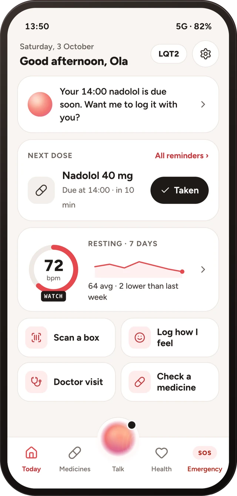
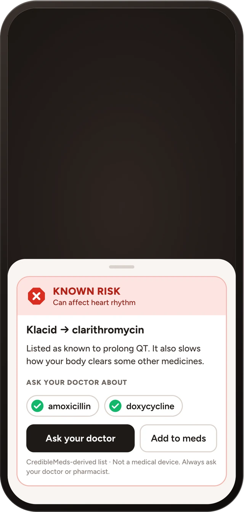
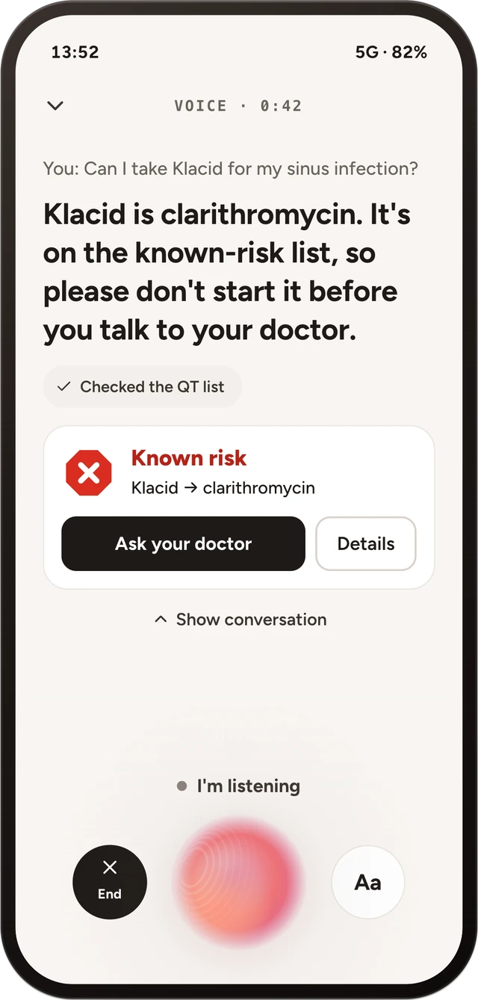
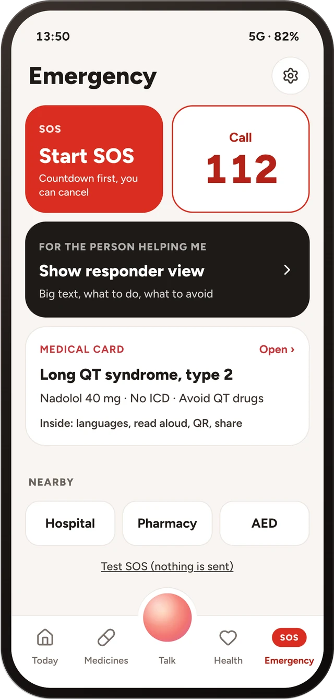
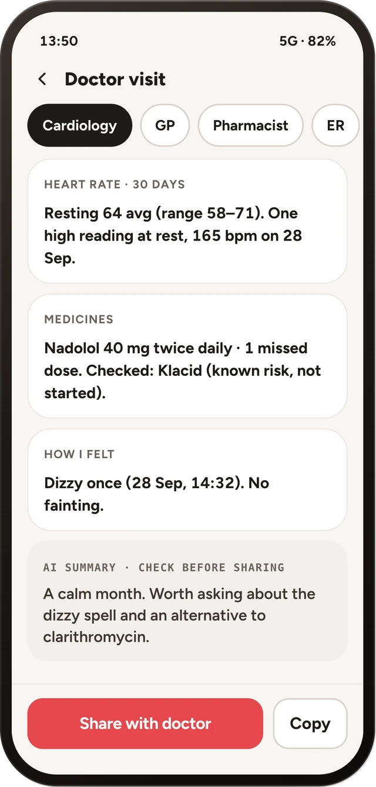

<sub>Real emulator captures of the phone app (HarmonyOS API 24 emulator, minimum API 20). Heart data on the emulator is simulated and labelled so.</sub>

</div>

---

## Contents

- [The problem](#the-problem) · [What Celia.ai does](#what-celiaai-does) · [Safety by design](#safety-by-design)
- [HarmonyOS capabilities used](#harmonyos-capabilities-used) · [Architecture](#architecture)
- [Run it yourself](#run-it-yourself): [prebuilt .hap](#fastest-path-install-the-prebuilt-hap) ·
  [phone app](#1-phone-app) · [watch app](#2-watch-app) · [backend](#3-backend-supabase) · [web pages](#4-web-pages)
- [Five-minute demo](#five-minute-demo) · [How to verify each feature](#how-to-verify-each-feature-emulator)
- [How each part works](#how-each-part-works): agent and Edge Functions, Celia intents, watch, SOS, film, decks
- [Tests](#tests) · [Privacy: what leaves the phone](#privacy-what-leaves-the-phone)
- [Repository layout](#repository-layout) · [Documentation](#documentation)
- [AI usage and third-party components](#ai-usage-and-third-party-components) · [Team](#team)

---

## The problem

**Long QT syndrome (LQTS)** is an inherited heart-rhythm disorder that affects about **1 in 2,000 people**. For them,
hundreds of everyday medicines (some antibiotics, anti-nausea pills, antidepressants, antihistamines) can trigger
*torsades de pointes*: fainting, or sudden cardiac death, often in young people. Each genotype has its own triggers
(LQT1 exercise and swimming, LQT2 sudden noise and emotion, LQT3 rest and sleep).

Patients are told "check every medicine against the list", yet the list is in English, organised by molecule, and
the box in their hand is a Polish brand name at 2 a.m. In an emergency, a paramedic who does not know their condition
may give exactly the wrong drug.

## What Celia.ai does

| | |
|---|---|
| **Talk to Celia** | An agent at the centre of the app (the orb in the tab bar). Ask by voice or text: *"Can I take Klacid?"*, *"I'm seeing the dentist tomorrow"*, *"I just took my nadolol"*. It calls on-device tools, shows deterministic verdict cards and opens the right screen. Works offline with a rule-based agent. |
| **Check any medicine** | Type a brand in any of several languages (typos fine), **scan a box barcode** (≈68k Polish packs bundled, unknown boxes resolved online or taught once) or **photograph the box** (on-device OCR). The verdict (Known / Possible / Conditional risk, or not on the lists) comes from a curated CredibleMeds-derived dataset, plus interactions with your own medicines. |
| **Heart monitoring** | A HarmonyOS **wearable app** reads heart rate and motion, checks it against your own limits and your genotype's triggers, and syncs to the phone. Health tab: resting heart rate, HRV, oxygen, sleep, steps, trends with fixed-rule status. |
| **SOS** | A critical alert opens a 30 s "Are you OK?" countdown, then calls 112 / shares a message / alerts your contacts. The watch has its own SOS. Live View card on the lock screen; backend texts and calls opted-in contacts (Twilio). |
| **Emergency card** | Condition, "do not give" list, medicines, ICD, contacts; in 13 languages, read aloud, as an **encrypted QR link**, NFC tag, lock-screen medical ID widget and a big-text first-responder view that works in airplane mode. CPR guide with a haptic metronome. |
| **Doctor visits** | Pick the kind of visit and why you are going: Celia builds a page to hand the doctor, with **"Please don't prescribe"** for that specialty, your heart data, medicines, symptoms and a labelled AI summary. Share as an encrypted, printable 48 h web report. |
| **Daily care** | Dose reminders with "Taken" from the notification, symptom log and feeling diary, genotype trigger coach, pharmacy card in the local language when you travel, nearby hospital / pharmacy / defibrillator. |
| **Celia system assistant** | Seven **Intents Kit** intents (`CheckDrugSafety`, `ShowEmergencyCard`, `LogSymptom`, `TakeDose`, ...) and seven home-screen widgets put the safety checks one step from anywhere on the phone. |

Accounts are optional: everything safety-critical runs on the phone, signed in or not, online or not.

## Safety by design

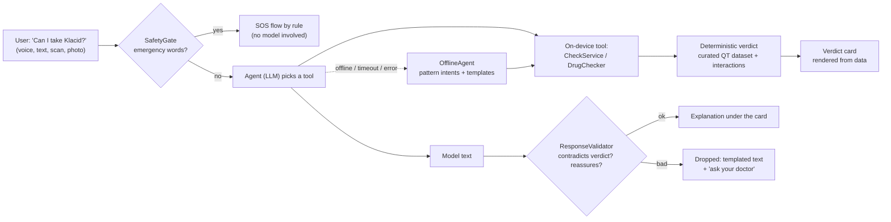

- **The model never decides.** Risk levels, interactions, emergency detection and SOS triggers are fixed rules and
  data. The model chooses tools and writes plain-language explanations.
- **Every model output is validated** (schema, length, banned claims such as reassurance about a risky medicine or
  doses). Anything off is dropped and the deterministic text is shown. Live voice has a streaming check that cuts off
  reassurance and speaks the verdict instead.
- **Offline first.** No network, backend down or bad model reply: the offline agent and the on-device dataset still
  answer. Tests run with `Config.forceOffline`.
- **Honest labels.** Simulated heart data says `SIMULATED` / `DEMO DATA`; AI text says `AI SUMMARY`. No ECG, no QT
  measurement. Not a medical device.

Details: [AI_FEATURES.md](AI_FEATURES.md).

## HarmonyOS capabilities used

| Capability | What Celia.ai does with it |
|---|---|
| **Intents Kit** (`insight_intent.json`, `insightintents/`) | 7 intents so Celia / Xiaoyi and system search can check a medicine, show the card, log a symptom or a dose |
| **Form Kit** (widgets) | Seven cards: The agent, Next dose, Resting heart rate, "Can I take this?", "How are you feeling?", Medical alert, Medical ID (lock screen) |
| **Live View Kit** | SOS countdown ticking on the lock screen and notification panel |
| **Notification Kit**, **Background Tasks Kit** (agent-powered reminders) | Dose reminders with Taken / Open actions, a separate loud emergency category |
| **Push Kit** | Watch SOS pushed to the patient's phone (built; needs AGC project) |
| **Scan Kit**, **Camera Kit**, **Media Library Kit** | Box barcodes from camera or album, photos of a medicine box |
| **Core Vision Kit** | On-device OCR of the box photo before any cloud fallback |
| **Core Speech Kit**, **Audio Kit** | On-device speech recognition and text-to-speech; live voice audio |
| **Sensor Service Kit** (watch + phone) | Heart rate, accelerometer and motion on the watch; vibration for haptics and the CPR metronome on the phone |
| **Location Kit** | Country detection for the travel pharmacy card, SOS location (only if allowed) |
| **Connectivity Kit** (NFC) | Write the emergency card link to an NFC tag |
| **User Authentication Kit** | App lock with the device screen lock / biometrics |
| **Crypto Architecture Kit** | AES-GCM encryption of shared cards and reports on the phone; key stays in the link |
| **ArkData** (relational store, preferences) | Encrypted local store: profile, medicines, chats, history |
| **Share Kit**, **Telephony**, **Accessibility Kit**, **Localization Kit**, **Network Kit** | System share sheet, dialer for 112 and contacts, screen-reader text, card languages, backend calls |

Phone permissions: `INTERNET`, `VIBRATE`, `NFC_TAG`, `PUBLISH_AGENT_REMINDER`, `ACCESS_BIOMETRIC`,
`APPROXIMATELY_LOCATION`, `LOCATION`, `MICROPHONE`. Camera and photos go through system pickers, so no camera or
storage permission is requested. Each runtime permission is asked only when you tap Allow in onboarding.

## Architecture

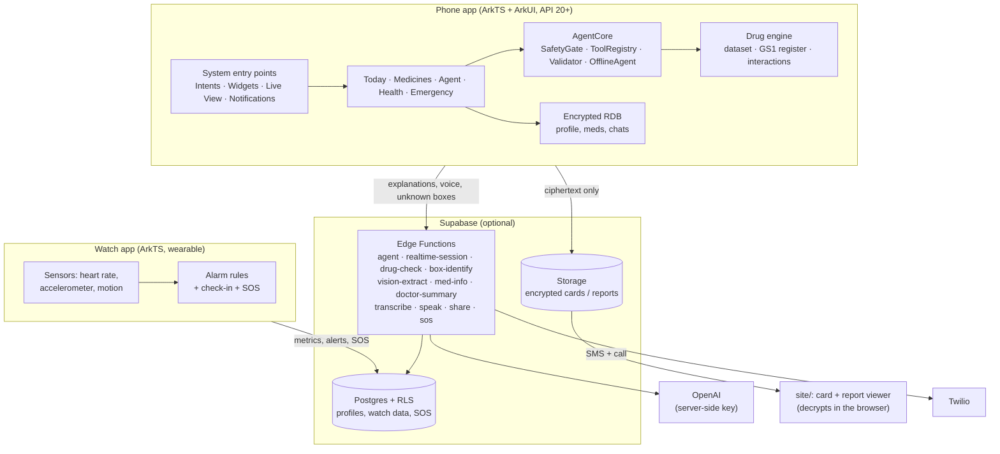

The phone app is self-sufficient. The backend adds the LLM (keys never leave the server), online lookups for
medicines outside the dataset, encrypted share links, account backup and watch-to-contact SOS.
Full description with data flows, modules and storage: **[docs/ARCHITECTURE.md](docs/ARCHITECTURE.md)**.

---

## Run it yourself

The project has four parts you can run. Only the first is needed to see the product.

| Part | Folder | Needed for | Time |
|---|---|---|---|
| [Phone app](#1-phone-app) | `app/` | Everything: medicine check, agent (offline), emergency card, SOS, doctor visits | 2-10 min |
| [Watch app](#2-watch-app) | `watch/` | Heart-rate monitoring on a wearable, watch SOS | 10 min |
| [Backend](#3-backend-supabase) | `backend/` | Online agent (LLM), voice, unknown boxes, share links, accounts, watch sync, SOS texts | 30 min |
| [Web pages](#4-web-pages) | `site/` | Opening a shared emergency card or doctor report in a browser, landing page | 2 min |

### Requirements

| | Version used |
|---|---|
| Host | macOS (Apple silicon). Windows works with DevEco Studio, but the helper scripts are bash |
| IDE | **DevEco Studio 6.1.1** (build DS-243.24978.46.36.611300); any 6.x should work |
| SDK | HarmonyOS SDK 6.1.1 (API 24) installed. Phone app `compatibleSdkVersion` and `targetSdkVersion` **6.0.0(20)**; watch app compatible 6.0.0(20), target 6.1.1(24) |
| Build tools | hvigor 6.24.4, ohpm 6.1.2, Node 18.20.1, hdc 3.2.0 (all bundled with DevEco Studio) |
| Phone emulator | DevEco Device Manager, phone profile (we use **"Pura 90"**, API 24) |
| Watch emulator | **`Huawei_Wearable`** (HarmonyOS 6.1.1 wearable image, API 21) |
| Optional | Deno 2 (backend tests and local backend), Supabase CLI, Python 3 (data scripts), Postgres 15+ (RLS tests), Node + ffmpeg (film) |

All terminal commands below run from the repository root after:

```bash
git clone https://github.com/x2oreo/Celia.ai.git && cd Celia.ai
source app/env.sh     # puts DevEco's hvigorw, ohpm, node and hdc on PATH; override DEVECO=... if not in /Applications
```

### Fastest path: install the prebuilt .hap

The [v1.0.0 release](https://github.com/x2oreo/Celia.ai/releases/tag/v1.0.0) (built from `main` at `8452c95`) has
unsigned HAPs that install on the DevEco emulators:

```bash
hdc list targets                          # phone emulator (and watch emulator, if running)

hdc -t <phone> install -r celia-phone-v1.0.0-unsigned.hap
hdc -t <phone> shell aa start -a EntryAbility -b com.celiaai.app

hdc -t <watch> install -r celia-watch-v1.0.0-unsigned.hap
hdc -t <watch> shell aa start -a EntryAbility -b ai.celia.watch
```

With one device connected, drop `-t <serial>`. SHA-256 checksums are in the release notes. A real phone or watch needs
a build signed with your own Huawei ID (see [Signing](#signing)).

### 1. Phone app

```bash
app/scripts/emu.sh up      # start the phone emulator if hdc sees none
app/scripts/test.sh        # 418 unit tests on the host, no device needed; non-zero exit on failure
app/scripts/run.sh         # build -> install -> launch -> screenshot (app/build/screenshot.jpeg)
```

Or open `app/` in DevEco Studio and press Run. `run.sh` installs the signed HAP, so set up signing once (below).

**Local configuration.** The first build copies `app/entry/src/main/ets/common/LocalConfig.example.ets` to
`LocalConfig.ets` (gitignored). **Leave it empty and the app runs fully offline**: deterministic medicine check,
offline agent, emergency card, SOS, doctor visits. Fill it in to turn on online features:

| Key | What it does |
|---|---|
| `BACKEND_URL`, `SUPABASE_ANON_KEY` | Your Supabase project URL and publishable key: online agent, voice, explanations, unknown boxes, accounts |
| `SHARE_BACKEND_URL`, `SHARE_ANON_KEY` | Share backend and watch data (defaults to the team project); also lets Health read the paired watch's trends |
| `SHARE_VIEWER_URL`, `CARD_VIEWER_URL` | Where share-link and card QR codes point (defaults to the hosted viewer) |
| `DEMO_VOICE_INPUT` | `'on'` plays bundled voice clips instead of the microphone (the emulator has none); the UI shows `SIMULATED VOICE INPUT` |

Unit tests assume an empty `LocalConfig.ets` (they run with `Config.forceOffline`).

#### Signing

`hvigorw assembleHap` without signing produces only `entry-default-unsigned.hap`, which `run.sh` does not install.

1. DevEco Studio → File → Project Structure → Signing Configs → sign in with a Huawei ID → **Automatically generate
   signature** (works for the emulator and for a real device). Do the same in `watch/` for the watch app.
2. DevEco writes local certificate paths and encrypted passwords into `app/build-profile.json5`. **Never commit that
   hunk.** Right after enabling signing, run once:
   ```bash
   git update-index --skip-worktree app/build-profile.json5
   ```
   (undo with `--no-skip-worktree` before you intentionally change that file). Certificates (`*.p12`, `*.cer`,
   `*.p7b`, `*.csr`) are gitignored and live outside the repo (`~/.ohos/config`).
3. Turn on the repo's pre-commit hook once per clone. It refuses commits that contain signing material,
   certificates, `LocalConfig.ets` or `.env` files:
   ```bash
   git config core.hooksPath .githooks
   ```

#### Real phone (HarmonyOS 6.0+)

```bash
app/scripts/device.sh check     # preflight only: API level, signing, backend
app/scripts/device.sh           # preflight -> build -> install -> launch -> screenshot
app/scripts/device.sh udid      # the phone's UDID, for a manual AppGallery Connect profile
HDC_TARGET=<serial> app/scripts/device.sh    # with several phones attached
```

Step-by-step setup, what to test on a phone and install errors: [docs/REAL_DEVICE.md](docs/REAL_DEVICE.md).

#### Helper scripts

| Script | What it does |
|---|---|
| `app/env.sh` | Puts the DevEco toolchain on PATH (`source` it) |
| `app/scripts/test.sh` | Host unit tests with a pass/fail summary |
| `app/scripts/run.sh [shot.jpeg]` | Build, install, launch, screenshot on the running emulator or device |
| `app/scripts/device.sh` | Same for a real phone, with a preflight check |
| `app/scripts/emu.sh up \| lock <who> \| unlock \| status` | Start the phone emulator; a lock so several worktrees can share one emulator |
| `app/scripts/ui.sh shot \| list \| tapt "text" \| tap X Y \| type X Y "text" \| swipe ...` | Drive the emulator from a terminal (screenshots, taps, typing) |
| `app/scripts/serve-card.sh [port]` | Serve the card viewer from this laptop so a phone on the same Wi-Fi can open the card QR |
| `scripts/worktree.sh <stream>` | Create a git worktree for a parallel work stream (used during the hackathon) |
| `python3 data/export_seed.py` | Regenerate `backend/supabase/seed.sql` from the app's drug dataset |
| `python3 data/export_gtins.py` | Regenerate the bundled Polish box-barcode register `rawfile/gtin_pl.json` |
| `python3 data/export_card_site.py` | Regenerate `site/card/data.js` (card viewer strings) from the app's sources |
| `python3 data/demo_history.py` | Regenerate the 60-day simulated demo history (phone and backend) |

### 2. Watch app

The watch app is a full HarmonyOS **wearable** app in its own DevEco project (`watch/`, bundle `ai.celia.watch`).

```bash
$DEVECO/tools/emulator/Emulator -hvd Huawei_Wearable &   # start the wearable emulator
watch/scripts/run.sh                                     # build -> install -> launch -> screenshot (watch/build/screenshot.jpeg)
```

`run.sh` picks the wearable by device type, so the phone emulator can stay connected (`WATCH_TARGET=<serial>` to
choose, `--no-build` to reinstall only). By hand:

```bash
cd watch && source env.sh && ohpm install
hvigorw --mode module -p module=entry@default -p product=default assembleHap --no-daemon
hvigorw test -p module=entry -p coverage=false --no-daemon      # 99 host unit tests
hdc install -r entry/build/default/outputs/default/entry-default-unsigned.hap
hdc shell aa start -a EntryAbility -b ai.celia.watch
hdc hilog | grep CeliaWatch
```

**Configuration.** Copy `watch/.env.example` to `watch/.env` (gitignored) and **rebuild after every edit**; the build
writes it into the bundled `rawfile/config.json`. Without it the watch works offline and keeps metrics in its outbox.

| Key | Default | What it does |
|---|---|---|
| `SUPABASE_URL`, `SUPABASE_ANON_KEY` | - | Backend to upload to (publishable key) |
| `WATCH_DEVICE_ID` | `demo-watch-1` in the example | Empty: a random id and pairing by code. The example sets the shared public `demo-watch-1` |
| `GENOTYPE` | `UNKNOWN` | `LQT1`, `LQT2`, `LQT3` or `UNKNOWN`; the phone's `watch_context` overrides it |
| `HIGH_BPM`, `REST_HIGH_BPM`, `SLEEP_HIGH_BPM` | 140, 120, 100 | Upper heart-rate limit while active, at rest, asleep |
| `LOW_BPM`, `SLEEP_LOW_BPM` | 45, 40 | Lower limit, awake and asleep |
| `ALERT_SUSTAIN_SEC` | 5 | Seconds out of range before an alert (filters sensor spikes) |
| `MEDICATION_NAME`, `MED_REMINDER_TIME` | nadolol, 08:00 | Log button label; daily system reminder (empty = off) |
| `DEMO_MODE`, `DEMO_SPEED`, `DEFAULT_SOURCE` | false, 4, `SENSOR` | `true` adds the Simulator page and scripted scenarios |
| `RESTING_BPM` | 65 | Starting resting heart rate before the first resting minute |

**Feeding heart rate on the emulator.** Emulator toolbar → **⋯** → **Virtual sensors** → **Heart rate**: move the
slider. The app reads it through the same `sensor.on(HEART_RATE)` code as a real watch. Hold it above 120 at rest
(140 active) or below 45 for 5 s to trigger an alert. With `DEMO_MODE=true`: Simulator → Source *Demo* → Scenario
**Full demo** plays exercise, slow recovery, startle, night bradycardia, irregular rhythm and a fall in about 75 s.

**Pairing with the phone.** The two emulators cannot see each other over Bluetooth, so they pair through Supabase:
watch Settings → *Phone* shows a 6-digit code (`pairing_start`); the phone enters it under Settings → Devices → Watch
(`pairing_claim`, which also binds the watch to the signed-in account); the watch polls `pairing_status` until
claimed. The first pairing gives the watch a random secret (only its hash is stored) that it sends as
`x-watch-secret` on every request.

### 3. Backend (Supabase)

One Supabase project serves both apps: Postgres tables and views with row-level security, 11 Edge Functions (Deno,
TypeScript) and a seed of the curated drug list. **Every secret lives only in Supabase secrets**; nothing secret is
in the repo or the HAPs.

```bash
cd backend
supabase link --project-ref <project-ref>
supabase db push                                   # every migration, in file-name order
psql "<connection string>" -f supabase/seed.sql    # or paste seed.sql into the SQL editor
supabase secrets set OPENAI_API_KEY=... SOS_WEBHOOK_SECRET=...   # full list below
supabase functions deploy agent realtime-session transcribe speak vision-extract drug-check box-identify med-info doctor-summary
supabase functions deploy share --no-verify-jwt    # anonymous browsers open share links
supabase functions deploy sos --no-verify-jwt      # authenticated by the x-sos-secret header instead
```

Then put the project URL and publishable key in the phone's `LocalConfig.ets` and the watch's `.env`. Apply
`20261004100300_watch_secret.sql` only together with a watch build that sends `x-watch-secret`. After changing the
agent prompt or tools, redeploy both `agent` and `realtime-session`.

<details>
<summary><b>Secrets (names only, values never in git)</b></summary>

Set with `supabase secrets set NAME=...`; locally in the gitignored `backend/supabase/functions/.env` (template
`.env.example`). `SUPABASE_URL`, `SUPABASE_ANON_KEY` and `SUPABASE_SERVICE_ROLE_KEY` are injected by Supabase.

| Name | Used by | Required? |
|---|---|---|
| `OPENAI_API_KEY` | AI functions; last step of `box-identify` | Yes for AI features |
| `OPENAI_MODEL`, `OPENAI_REASONING_EFFORT`, `OPENAI_VISION_MODEL`, `OPENAI_TRANSCRIBE_MODEL`, `OPENAI_TTS_MODEL`, `OPENAI_TTS_VOICE`, `OPENAI_REALTIME_MODEL` | AI functions | Optional overrides of the defaults in code |
| `OPENFDA_API_KEY` | `drug-check` tier 2 | Optional (lower rate limit without) |
| `BOX_VOTE_SALT` | `box-identify` confirmations | Optional |
| `SHARE_REPORT_TTL_MINUTES` | `share` | Optional, testing only |
| `SOS_WEBHOOK_SECRET` | `sos` | Yes, must match the Vault secret `sos_webhook_secret` |
| `TWILIO_ACCOUNT_SID`, `TWILIO_AUTH_TOKEN`, `TWILIO_FROM_NUMBER` | `sos` SMS and calls | Optional (without them: dry run) |
| `HUAWEI_PUSH_PROJECT_ID`, `HUAWEI_PUSH_SA_KEY` | `sos` push to the phone | Optional (without them: push dry run) |
| `SOS_GLOBAL_MAX_PER_HOUR` | `sos` | Optional, default 10 |
| `AI_DAILY_CAP` | AI functions (`_shared/rateLimit.ts`) | Optional, project-wide daily cap on OpenAI calls, default 5000 |

</details>

<details>
<summary><b>SOS texts and calls (Twilio, Vault)</b></summary>

```bash
supabase secrets set SOS_WEBHOOK_SECRET=$(openssl rand -hex 24)
supabase secrets set TWILIO_ACCOUNT_SID=... TWILIO_AUTH_TOKEN=... TWILIO_FROM_NUMBER=+1...            # optional
supabase secrets set HUAWEI_PUSH_PROJECT_ID=... HUAWEI_PUSH_SA_KEY='<service-account key JSON>'      # optional
```

Then in the SQL editor (the values stay in Vault):

```sql
select vault.create_secret('https://<project-ref>.supabase.co/functions/v1/sos', 'sos_function_url');
select vault.create_secret('<same value as SOS_WEBHOOK_SECRET>', 'sos_webhook_secret');
-- test without the phone app (the app writes contacts through sync_sos_contacts):
insert into emergency_contacts (device_id, name, phone) values ('demo-watch-1', 'Mom', '+48123456789');
```

End-to-end check: insert an SOS row the way the watch does, then read the audit row.

```sql
insert into watch_metrics (device_id, type, payload, recorded_at, source)
values ('demo-watch-1', 'sos', '{"reason":"fall","bpm":172,"lat":50.0614,"lon":19.9366}', now(), 'simulated');
select status, detail, created_at from sos_dispatches order by id desc limit 1;
```

`status` is one of `sent`, `partial`, `failed`, `dry_run`, `skipped_cooldown`, `no_contacts`, `skipped_global_limit`.
A Twilio trial account reaches only verified numbers; Push Kit works only on phones in the Chinese mainland.

</details>

<details>
<summary><b>Run the backend locally for the emulator (no deploy)</b></summary>

`backend/eval/dev-backend.ts` serves every Edge Function on `127.0.0.1:8000/functions/v1/<name>` with Deno, no
Supabase CLI needed. AI calls are real (paid) OpenAI calls.

```bash
set -a; source backend/supabase/functions/.env; set +a      # your OPENAI_API_KEY; never printed
npx -y deno@2 run -A backend/eval/dev-backend.ts &          # functions on 127.0.0.1:8000
hdc rport tcp:8000 tcp:8000                                 # the emulator's 127.0.0.1:8000 -> this Mac
# in LocalConfig.ets:  BACKEND_URL = 'http://127.0.0.1:8000'   SUPABASE_ANON_KEY = 'local-dev'
app/scripts/run.sh
```

Empty `LocalConfig.ets` again before running the unit tests.

</details>

### 4. Web pages

`site/` is a static site (hosted on Vercel at `celia-share.vercel.app`, no build step, no data stored there):

| Page | What it does |
|---|---|
| `site/card/` | Opens an emergency-card link or QR: decrypts the card **in the browser** with the key from the URL fragment (never sent to a server) and shows it in the reader's language (13 languages), 112 first |
| `site/report/` | Same for a doctor report (48 h link, printable) |
| `site/index.html` | Landing page with the launch film |

Run locally with any static server, e.g. `python3 -m http.server 8080 -d site`. On `localhost` the pages talk to the
local dev backend; otherwise to the `share` function in `site/assets/config.js`. `site/vercel.json` sets a strict
Content-Security-Policy, so every image and video must be served from the site itself (`site/media/demo.mp4` and
`demo-poster.jpg` are in place; `hero-phone.png` and `team.jpg` slots keep their placeholders until added).

### What the emulator cannot do

| Needs real hardware | On the emulator instead |
|---|---|
| Real heart-rate readings from a worn watch | Watch emulator's virtual heart-rate slider; on the phone, simulated scenarios (Health → Demo controls), labelled `SIMULATED` |
| Microphone | Bundled demo voice clips (`DEMO_VOICE_INPUT = 'on'`), badge `SIMULATED VOICE INPUT` |
| Camera capture of a box | Gallery picker fallback; barcodes can be typed |
| Celia / Xiaoyi routing to our intents | Intents are compiled and registered; the same features are in the app |
| Wear sensor (on-wrist detection) | Simulator page (`DEMO_MODE=true`) |
| NFC, Push Kit, lock-screen widget placement, Live View on a real phone | Built; marked "unverified" in the table below |

---

## Five-minute demo

1. **Launch** on the phone emulator: Welcome → *Set up without an account* → onboarding (genotype LQT2, add
   `Nadolol`) → **Today**.
2. **Ask Celia**: tap the orb → `Aa` → *"Can I take Klacid?"* → verdict card **Known risk** (clarithromycin) with
   safer alternatives to ask your doctor about. Works offline.
3. **Scan a box**: Medicines → Scan, or type `5909990331710` → Klacid → verdict + "About this medicine".
4. **Heart alert**: Health → Demo controls → `lqt2 startle tachy` → 30 s "Are you OK?" countdown → let it run →
   call 112 / share / contacts.
5. **Emergency card**: Emergency → *For first responders* (works in airplane mode) → *Show card as QR code* → open
   on any phone camera in the reader's language.
6. **Doctor visit**: Today → Doctor visit → New visit → Dentist → visit page with **Please don't prescribe**.
7. **Watch**: run the watch app on `Huawei_Wearable` → *All good, 72 bpm* → press SOS → the phone opens "Your watch
   sent an SOS".

## How to verify each feature (emulator)

Everything below runs on the emulator with **no backend and no watch** unless the row says otherwise. Heart data is
simulated and labelled so. Rows marked **built, unverified** compile and pass unit tests but could not be seen
working on the emulator.

<details open>
<summary><b>Medicines: check, scan, interactions, reminders</b></summary>

| Feature | How to check |
|---|---|
| Drug check (F-05, F-07, F-20, F-21) | Medicines → type `Klacid`, `Zofran 8 mg`, `Сумамед`, `ondansetrom` (typo) or `xyz` → verdict card; "How we know" shows each step. |
| Interactions (F-19) | Add `Cipralex` to my medicines, then check `ondansetron` (adds up) or `clarithromycin` (CYP3A4). |
| Barcode (F-36) | Medicines → Scan (camera or album). Any Polish box resolves from the bundled register (≈68k packs), e.g. type `5909990331710` (Klacid) or `5909990296026` (Apap) → verdict + "About this medicine" (substance, strength, form, pack, Rx/OTC, ATC group, holder, leaflet). Unknown boxes (e.g. Bulgarian) open "teach this barcode"; the next scan resolves instantly. Demo codes `2000000000015`… still work. Regenerate the register with `python3 data/export_gtins.py`. |
| Medicine sheet, AI explanation | Medicines → tap a medicine: risk band, what it's for, interactions, brands. "Explain it in plain words" (backend only; hidden offline) shows an `AI SUMMARY`; replies that mention QT/arrhythmia/doses are dropped. |
| History, dashboard (F-23, F-24) | Today shows meds by risk, interactions and recent checks; Medicines → Check history (filters). |
| Reminders (F-38) | Medicines → Medicine reminders. System reminders need an AGC quota; the in-app fallback notifies while the app runs. |
| Dose "Taken" from the notification (B7) | Add a reminder; when it is due the notification has Taken / Open. Taken opens Celia on Reminders with the dose TAKEN. Emulator check: `hdc shell aa start -a EntryAbility -b com.celiaai.app --ps notifyAction DOSE_TAKEN --ps notifyKind DOSE_DUE --pi notifyId <2000+id%1000> --pi reminderId <id>` |

</details>

<details>
<summary><b>Agent: chat, voice, tools</b></summary>

| Feature | How to check |
|---|---|
| Agent stage, saved chats (F-02, T7) | Tap the orb in the tab bar → "Aa" → ask "Can I take Klacid?" (works offline with the deterministic agent). Header: Chats and + (new chat). Chats → long press → Rename / Delete. "new chat" / "start over" work offline. |
| v2 layout, silk orb, Lucide icons | Cold start lands on **Today** (agent line, next dose, resting 7 days, four tiles). Tab bar: Today · Medicines · orb · Health · Emergency. Orb → agent stage: the orb sits at the bottom centre, tap it to talk, tap again to mute, `End` on the left; captions grow above it, "Show conversation" opens the thread. Health: Today / 14 days / 30 days switch. Medicines: Today's doses row. Emergency: Start SOS + Call first. Spec: `docs/design/DESIGN.md` §6.5, §6.6, §6.6b, §10.1a. |
| Agent reaches the screens (page tools) | Ask or say "Show me the symptoms I logged recently", "Open my medicine reminders", "How has my heart rate been?", "I'm seeing the dentist tomorrow" → a tool step, a sentence built from the phone's own data, and a tile that opens Symptom log, Reminders, Trends or Doctor prep. Symptom-log tile seen opening the page on the emulator; the reminders, trends and doctor-prep tiles were seen, not all tapped. Online, the backend's `agent` and `realtime-session` functions must be at prompt `2026-10-04.1` (18 tools); older deployments lack the page tools. |
| Agent logs a dose, with confirmation | Set a reminder for a time that has passed today, say "I just took my nadolol" → a card "Mark this dose as taken?" → Confirm → the reminder shows Taken. Nothing is written before the tap. **Unit tests only (6); the card has not been seen on screen.** |
| Follow-up chips after a verdict | Ask "Can I take ondansetron?" → chips under the verdict card, chosen by the risk level, not by the model. Seen on the emulator; not tapped. |
| Photo of a box from the agent | Agent → camera button: opens the system camera; when no camera can be opened it opens the gallery. On the emulator the gallery fallback was seen. **Camera capture is unverified (needs a real phone).** |
| Demo voice without a microphone | `DEMO_VOICE_INPUT = 'on'`: each new voice session plays the next of the 8 bundled clips (ondansetron, dentist, doses, trends, symptoms, reminders, took a dose, dizzy; one session is a barge-in pair) with the `SIMULATED VOICE INPUT` badge. All run on the emulator; the audio output was not listened to. |
| One header, quick links | Medicines, Heart, History, Reminders, Symptom log, Trends, Chats, Check result and Scan have the same header (back on pushed pages, title, settings gear). Heart: chips under the ring for Log a symptom, Trends, Doctor prep. Medicines: chips under the search for Reminders, History. Seen on the emulator. |

</details>

<details>
<summary><b>Heart, symptoms and SOS</b></summary>

| Feature | How to check |
|---|---|
| Heart + alerts (F-09, F-32) | Health → Demo controls → `lqt2 startle tachy`, `lqt3 night brady`, `lqt1 exercise`, `irregular rhythm`, `watch disconnect`. |
| Health metrics | Health → a card per watch metric (resting heart rate, HRV, oxygen, breathing, sleep, steps, stress time) with a mini chart and a fixed-rule status (Good / Okay / Worth a look). Tap a card, or the live heart-rate card, for its page: chart with the usual-range band (drag across it to read a day), `14 days · 30 days` (heart rate adds `Now`), "What this means", average / lowest / highest. HRV, oxygen and breathing are simulated by the watch and always labelled. No ECG, no QT. Seen on the emulator with demo data; not with real watch rows (needs migration `20261004060000_watch_vitals_daily.sql` on the backend). |
| Trends from the cloud project | With `SHARE_ANON_KEY` set in `LocalConfig.ets`, Health (14 / 30 days) and the Trends page read `watch_daily_summary` and `watch_insights` of the paired watch even while the AI backend is a local dev server; `SIMULATED` shows when a row is marked simulated, `WATCH` for real rows. Seen with the project's simulated rows, 14 and 30 days, and offline with "Try again". **Unverified with real watch rows: the demo watch has none.** |
| SOS (F-27, F-28, F-35) | A CRITICAL alert (e.g. `lqt2 startle tachy`) opens the 30 s "Are you OK?" countdown → "I'm OK" or let it run → call / share message / call contacts. Settings → Test SOS runs a 10 s test marked TEST. 10-min cooldown for automatic SOS. |
| SOS page honesty (B8) | Let a phone SOS countdown run out: "Nothing has been sent yet … Nobody yet", then the call / share / contact / responder buttons. |
| Notifications per kind (B7) | Settings → notifications for Celia.ai: emergency is a separate loud category. Start an SOS countdown and pull down the panel: "SOS in N s" notification. Real phone: tap it to show I'm OK / Open (built, unverified on screen: emulator does not draw buttons). |
| SOS Live View (B13) | Start an SOS countdown, pull down the panel / lock the screen: a live card "SOS in 00:25" ticking, red capsule. "I'm OK" → card "SOS cancelled". Works on the emulator; on a real phone needs Live View approval (built, unverified there). |
| Watch SOS without a second countdown (B8) | Press SOS on the paired watch. The phone opens "Your watch sent an SOS" directly (no countdown): what was sent, to whom, what still needs a tap, plus For first responders. |
| Push: watch SOS to the phone (B12) | Built, unverified: needs an AGC project with Push Kit, the service-account key in Supabase secrets, B9's watch↔account binding and a Chinese-mainland phone. Emulator check of the tap: `hdc shell aa start -a EntryAbility -b com.celiaai.app --ps route sos --ps source watch --ps loc 1` → "Your watch sent an SOS". `hilog \| grep PushToken` shows why no token. |
| SOS contacts with consent (B10) | Signed in + paired: Settings → Account → switch on → "2 contacts ready"; `select count(*) from emergency_contacts` matches; switch off → 0. Migrations applied and retested on the live project on 4 Oct. |
| SOS status | After a watch SOS, Account shows "Last SOS …: test mode, no text or call was sent" while Twilio is not configured. |
| Symptom log (F-44, T27) | Today → Log how I feel (or Health → Log how I feel); fainting / chest pain shows an SOS button. Or tell the agent "I felt dizzy after the alarm" (backend): it calls `log_symptom`; red flags start the SOS countdown by rule, not by the model. Appears in the doctor brief. |
| Feeling diary (B15) | Route `feeling` (Today tile or the "How are you feeling?" widget): pick a mood, optional note, Save → listed under RECENT. Low / Unwell offers "Log a symptom". |

</details>

<details>
<summary><b>Emergency card, first responders, travel</b></summary>

| Feature | How to check |
|---|---|
| Emergency card (F-08, F-26, F-29, F-30) | Emergency tab → Show card as QR code. With a backend, the card is encrypted on the phone and uploaded to the `share` function; the QR is a short link (`/card/#<id>.<key>`) that any phone camera opens as the formatted card in the reader's language (13 languages), with 112 first. "Remove this link" revokes it. Offline/no backend: the QR carries the whole card (legacy link). Celia's own scanner opens both kinds inside the app. |
| Emergency details (B4) | Settings → Emergency details → fill blood type, allergies, cardiologist; Emergency tab → full card shows them in a fixed order; switch "Show on card" off → the field disappears from the card and the QR. |
| Card payload v2 | Emergency tab → QR → open link: details shown; an old v1 link still opens (test `CardPayloadV2.oldV1LinksStillOpen`). |
| First-responder view (B5) | Emergency tab → "For first responders": do not give, use instead, care notes, medicines, details, call buttons; works in airplane mode. |
| Responder from lock screen | Privacy → App lock on → background 5 min → lock screen → "For first responders" (built, unverified on the emulator). |
| Responder from widget | Add the 2×4 Medical alert card → tap its text (built, unverified). |
| Lock-screen medical ID (B13) | Long-press the app icon → Widgets → "Medical ID (lock screen)". Shows condition, AVOID line, ICD, medicines; hidden card fields stay off; no contacts. Lock-screen placement: real phone only (built, unverified). |
| NFC card tag (B14) | Real phone with NFC: Emergency → Show card as QR → Write to NFC tag → hold an NTAG213+ sticker → tap the tag with another phone (built, unverified). |
| Card language, read aloud (T11, T25) | Emergency → pick one of 13 card languages (saved) → **Read the card aloud**: only the medical part, never name or contacts (on-device English voice, cloud `/speak` otherwise; hidden with neither). |
| Help guide (F-41) | Emergency → Help guide: 3 steps + CPR metronome 110/min (haptic). Also reachable from the lock screen. |
| Pharmacy card, travel (F-40, T23) | Emergency → Pharmacy card: in the language of the country you're in, with English below. With location allowed, being in another country than Settings shows "You're in …" on Today (country found on the phone; nothing uploaded). |
| Nearby help (T26 fallback) | Emergency → Nearby help → Hospital / Pharmacy / Defibrillator: a map search around the phone (map app or browser; the app sends no location). The in-app map needs a Map Kit key. |

</details>

<details>
<summary><b>Doctor visits</b></summary>

| Feature | How to check |
|---|---|
| Doctor visits (F-31) | Today → Doctor visit → **New visit**: pick the kind of doctor, write why you are going (or tap a starter), the date and, if you like, what worries you; a card shows what the visit looks like (fixed keyword rules on the phone, no AI) → **Create visit page**. The page is what you hand to the doctor: who you are and why you came, **Please don't prescribe** (known-risk medicines for this kind of visit, from the QT list; possible/conditional fold open; what is not on the lists), a labelled AI summary, then the full brief folded. **Share** in the header sends an encrypted web report with the same card at the top (48 h link, printable); copy link / copy text / share as text below. Every visit stays in the gallery (latest on top, long press to delete). New-visit form and visit page seen on the emulator; gallery cards, share and the web block not yet. |
| Doctor summary (T13) | Opening a visit page fetches it once (backend only) and keeps it with the visit: 2-3 sentences from the brief's medicines, risk words, interactions, counts, and the visit plan's purpose titles and known-risk names - never name, notes, symptom notes or the reason you typed. Reassurance or doses → dropped; a retry button appears when it fails. |
| Redaction before the AI summary | Unit tests `Redact` / `summarySendsRedactedAnswersOnly`: names of the patient, contacts, cardiologist, hospital, phone numbers, e-mails and links become `[removed]` before a visit's reason or worries could be sent. The visit page sends neither: the AI summary gets the plan's purpose titles and known-risk names only. |

</details>

<details>
<summary><b>First run, accounts, privacy</b></summary>

| Feature | How to check |
|---|---|
| Welcome on first launch | Uninstall, `app/scripts/run.sh` → Welcome with Create an account / I already have an account / Set up without an account. |
| Onboarding (F-01, B3) | Fresh install (`hdc uninstall com.celiaai.app`, then `app/scripts/run.sh`): 8 steps with a progress bar and "Step N of 8". Continue stays inactive until the consent box is ticked. Type a contact name, go Back and forward again: the text is still there. Skip on steps 2 and 4-8. Permissions step: each Allow opens the system dialog only when tapped. Finish lands on Today; relaunch does not show onboarding again. |
| No notification prompt on launch | Relaunch the app after onboarding: no notification dialog appears (it is asked only in onboarding step 7). |
| Sign up / log in (B1) | Welcome → Create an account → email + 8-char password → lands in onboarding (new) or the app (profile restored). Needs migration `20261004100000` and "Confirm email" off. |
| Stay signed in offline (B1) | Sign up, kill the app, turn the network off, reopen → main screen, Settings → Account shows the email. |
| Profile backup (B2) | Signed in, change the name in Settings → Account shows "Backed up …"; in Supabase `select updated_at from profiles` changes. |
| Restore on a new phone (B2) | Uninstall, reinstall, Welcome → I already have an account → log in → skips onboarding, profile and medicines back. |
| Delete cloud data | Settings → Account → Delete my data from my account → row gone, signed out, phone data kept. |
| Old profiles load | `app/scripts/test.sh` → `StoredProfile.oldStoredProfileLoadsWithDefaults`. |
| Privacy ledger, app lock (F-45, F-46) | Settings → What left my phone: every outbound request - drug check, agent, voice, vision, explanations, share links, live voice - with field names and size, never values; **Export the list**. App lock needs a screen lock (PIN) on the device. |
| Ledger exceptions | Settings → Privacy → What left my phone → `/rest/v1/profiles` rows list field names with `exception: PROFILE_SYNC`. |
| Screen-reader text | Verdicts are read by their word ("Known risk"), cards as one sentence, selected chips as selected. **In the code; not checked with the screen reader on.** |
| Reduced motion | API 23+: follows the system "reduce animations" setting; API 20-22 have no such setting, so an animation scale of 0 is used instead. **Read path runs without errors; never seen switched on.** |

</details>

<details>
<summary><b>System integration: Celia intents, widgets</b></summary>

| Feature | How to check |
|---|---|
| Celia intents (F-11, T20) | `CheckDrugSafety`, `ShowEmergencyCard`, `LogSymptom`, `TakeDose`, `ShowPharmacyCard`, `AddMedication`, `ReadEmergencyCard` (`insight_intent.json`). Built and compiled; routing from Celia needs a real device with Celia/Xiaoyi. |
| Widgets (F-12) | Long-press the app icon → Widgets: seven cards (The agent, Next dose, Resting heart rate, "Can I take this?", "How are you feeling?", Medical alert, Medical ID (lock screen)). "Help this person" on Medical alert opens the bystander guide. |

</details>

<details>
<summary><b>Watch app</b></summary>

| Feature | How to check |
|---|---|
| Watch build + install | `watch/scripts/run.sh` with the `Huawei_Wearable` emulator running → screenshot in `watch/build/screenshot.jpeg`. |
| Watch unit tests | `cd watch && source env.sh && hvigorw test -p module=entry -p coverage=false --no-daemon` → 99/99. |
| Accelerometer slows at rest | Run the watch app, keep the emulator still 30 s, `hdc -t <watch> hilog \| grep CeliaWatch` → `accelerometer every 100 ms`. |
| Shared HTTP session | With `watch/.env` filled, tap *Fine* on the check-in page → row in `watch_metrics` for the device id. |
| Watch context (T15) | With the cloud backend, a risky check writes `watch_context` (genotype, ingredient, risk) and the Celia watch shows the verdict glance within 60 s. |
| Watch data only for its owner (B9) | `backend/supabase/tests/run-rls.sh` → ALL ACCOUNTS RLS CHECKS PASSED; on the emulators: paired + signed in shows the watch's heart rate, signed out shows nothing for it. |

<p>
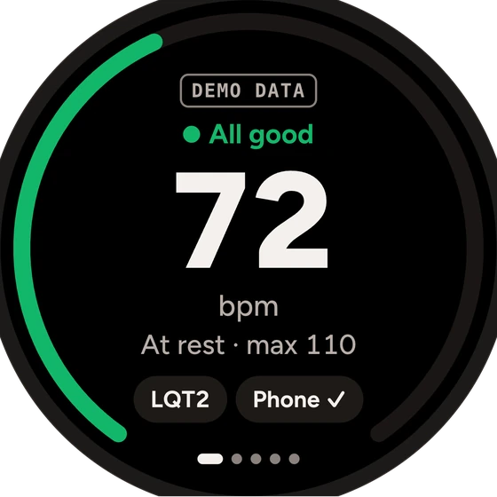
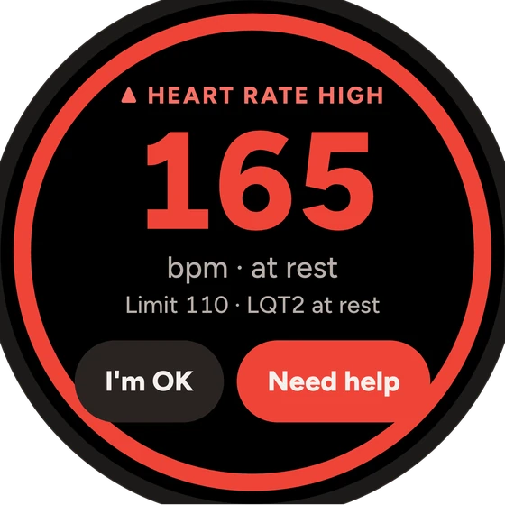
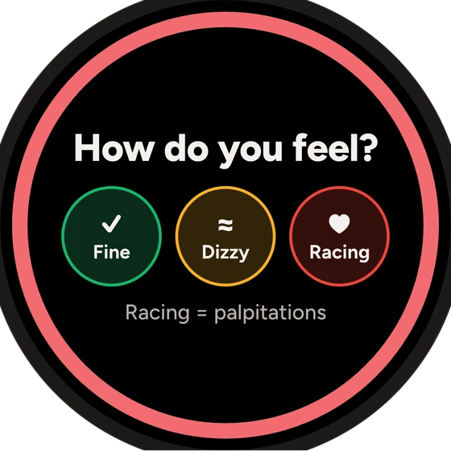
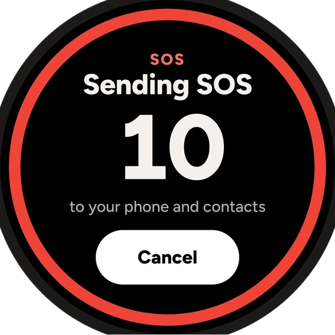
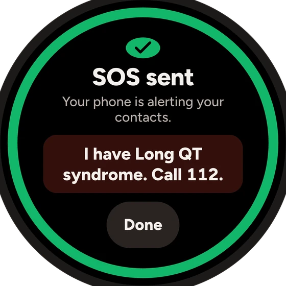
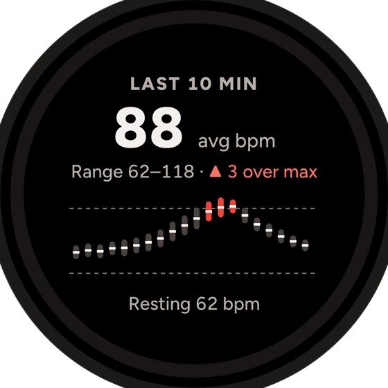
</p>

</details>

## How each part works

Reference for each component. The full system description with data flows is in
[docs/ARCHITECTURE.md](docs/ARCHITECTURE.md); the AI design is in [AI_FEATURES.md](AI_FEATURES.md).

<details>
<summary><b>Agent and Edge Functions</b></summary>

The agent loop and every tool run **on the phone** (`app/entry/src/main/ets/agent/`). The backend's `agent` function
performs one model step and returns tool calls; the phone executes them against its own data and sends the results
back. Medical verdicts never come from a model: `drug-check` is deterministic, and every AI function either relays the
loop or explains, with its output checked on the server and again on the phone.

| Function | AI? | Purpose |
|---|---|---|
| `agent` | yes | One model step of the agent loop (OpenAI Responses API); tools run on the device |
| `realtime-session` | yes | A 2-minute OpenAI Realtime client secret with the same instructions and tools, for hands-free voice |
| `transcribe` | yes | Push-to-talk speech-to-text fallback (WAV 16 kHz mono in, text out; audio not stored) |
| `speak` | yes | Text-to-speech fallback (raw PCM 24 kHz out) |
| `vision-extract` | yes | Box photo → medicine **names only**, with confidence; never judges risk |
| `drug-check` | no | Deterministic QT verdict: curated `drugs` table, then RxNav ingredients + openFDA label rule (cached) |
| `box-identify` | last step only | Barcode → brand and English ingredients: cache, registries and product databases, AI web search last; never a verdict |
| `med-info` | yes | Plain-language medicine explanation; never heart safety or doses; banned words → dropped |
| `doctor-summary` | yes | 2-3 sentences above the deterministic doctor brief; no name, notes or contacts sent; reassurance or doses → dropped |
| `share` | no | Stores end-to-end encrypted card and report blobs (ciphertext only; reports expire after 48 h) |
| `sos` | no | Watch SOS → Huawei Push to the owner's phone, then deterministic SMS + voice call to each contact (Twilio) |

Shared code in `backend/supabase/functions/_shared/`: `prompt.ts` (system prompt, `PROMPT_VERSION` `2026-10-04.1`),
`tools.ts` (the 18 tool schemas shared by `agent` and `realtime-session`), `openai.ts`, `validate.ts` (requests with
personal identifiers are rejected), `rxnav.ts` / `openfda.ts` / `labelRisk.ts` (tier-2 lookup), `gtin.ts`,
`clientIp.ts`.

**Agent tools (18):** `get_my_meds`, `check_drug`, `get_vitals_summary`, `explain_condition`, `suggest_alternatives`,
`scan_medicine`, `add_med`, `show_emergency_card`, `start_emergency`, `share_emergency_card`, `log_symptom`,
`prepare_doctor_visit`, `get_dose_status`, `get_trends`, `open_symptom_log`, `open_reminders`, `log_dose`,
`start_new_chat`. Each has an executor in `app/entry/src/main/ets/agent/tools/`. Writes (`add_med`, `log_dose`) only
happen after the user taps Confirm.

```jsonc
// POST /functions/v1/agent - first step of a turn
{ "context": { "condition": "LQTS", "genotype": "LQT2", "meds": ["nadolol"],
               "vitals": "HR 72 at rest, no alerts (simulated)", "emergencyNumber": "112", "locale": "en-GB" },
  "messages": [{ "role": "user", "text": "Can I take Klacid?" }] }
// response
{ "promptVersion": "2026-10-04.1", "responseId": "resp_…",
  "toolCalls": [{ "callId": "call_…", "name": "check_drug", "arguments": "{\"name\":\"Klacid\",\"dosage\":null}" }],
  "text": "" }
// next request, after the device ran the tools
{ "context": { … }, "messages": [],
  "continuation": { "previousResponseId": "resp_…", "toolOutputs": [{ "callId": "call_…", "output": "{…}" }] } }
```

Errors: `400` invalid request, `502` model error or timeout. The app treats any non-200 as "use the deterministic
fallback".

</details>

<details>
<summary><b>Celia system assistant (Intents Kit)</b></summary>

Seven `@InsightIntentEntry` entry points in `app/entry/src/main/ets/insightintents/`, registered in
`resources/base/profile/insight_intent.json`. **None uses the LLM**: each runs the same deterministic code as the app;
`llmDescription` only tells the assistant when to pick it.

| Intent | Mode | Parameters | What it does |
|---|---|---|---|
| `CheckDrugSafety` | background | `drugName` | Full deterministic check; Celia reads the verdict sentence aloud. Empty or failed → "ask a pharmacist" |
| `LogSymptom` | background | `symptom`, `severity` 1-5 | Saves the symptom with the recent heart rate; a red-flag symptom gets the emergency number read out |
| `TakeDose` | background | - | Marks the dose due now (or the earliest missed one today) as taken; never one that is not yet due |
| `ShowEmergencyCard` | foreground | - | Opens the Emergency tab |
| `ReadEmergencyCard` | foreground | - | Opens the Emergency tab and reads the medical part of the card aloud (no name or contacts) |
| `ShowPharmacyCard` | foreground | - | Opens the pharmacy card for a pharmacist abroad |
| `AddMedication` | foreground | - | Opens Medicines, where the user adds and confirms; never added silently by voice |

Intents reach the UI through `common/TabRequest.ets` and `common/RouteRequest.ets`, which hold a request made during a
cold start until the screens exist. Try on a device: "Celia, can I take ibuprofen?", "Log that I felt dizzy",
"I took my medicine". Whether Celia routes to third-party intents outside China is unverified; the in-app agent covers
the same features.

</details>

<details>
<summary><b>Watch app</b></summary>

Why a full wearable app: the Huawei Watch GT series runs *lite wearable* JS apps, and the SDK's lite wearable device
definition has no network capability, so a GT app could not reach our server. The watch app is therefore a HarmonyOS
**wearable** app (API 20+, like Watch 5 / Watch Ultimate) that talks HTTPS to Supabase itself.

```
heart-rate sensor ─► HeartRules (limits, alarms, recovery) ─► alert screen + vibration + notification
accelerometer, wear, steps ─► rest / active / asleep, falls, on-wrist
                  ─► MetricOutbox ─► SyncEngine ─► RestClient ─► Supabase watch_metrics ─► phone app
phone app ─► watch_context (genotype, risky medicine, alert answered) ─► polled by the watch
```

**Code** (`watch/entry/src/main/ets/controller/`): `WatchController` owns screen state and a 1 s tick, and delegates
to `SensorHub` (sensors, accelerometer rate), `HeartRules` (limits, alarms, resting HR, simulated vitals), `SosFlow`
(fall check → SOS), `SyncEngine` (outbox uploads in batches of 50) and `PairingFlow` (6-digit code). All network
calls share one Remote Communication Kit session.

**Screens** (swipe): Home (bpm on a ring between your limits, status word and shape) · Medical ID (for a bystander:
condition, genotype, avoid QT drugs, call 112; no names or numbers) · Heart 10 min · Vitals (Good / Okay / Worth a look,
`SIM` where simulated) · Log (Fine / Dizzy / Racing, "Log nadolol as taken", SOS) · Settings (pairing, limits and
why) · Simulator (only with `DEMO_MODE=true`). Full-screen moments: heart rate high / low, fall detected (30 s),
irregular rhythm / low HRV / low oxygen / slow recovery, "How do you feel?", SOS countdown (10 s), drug verdict
glance, missed dose, not on wrist. "I'm fine" on the phone closes the same alert on the watch within 3 s, and the
other way round. **The watch never dials 112 itself**: the `sos` row is the trigger.

**Alert rules** (deterministic, configurable demo heuristics, not clinical advice):

| Alert | Rule |
|---|---|
| Heart rate high / low | Outside the current limit for `ALERT_SUSTAIN_SEC` (5 s), then 60 s cooldown per direction |
| Current limit | Max: rest 120, active 140, asleep 100. Min: 45, asleep 40. LQT1 -10 while active, LQT2 -10 at rest, LQT3 min +5, recent risky medicine -10 on every max |
| Slow recovery (LQT1) | Less than 12 bpm drop in the 60 s after an exercise bout of 20 s or more |
| Low HRV / low SpO2 / irregular rhythm | Simulated input, real rule: HRV < 20 ms at rest, SpO2 < 92 %, rhythm flag |
| Fall | Impact > 2.5 g, then still 1-4 s later → 30 s "Are you OK?" → SOS |
| SOS | *Need help* or unanswered fall → 10 s countdown → `sos` row (with location if allowed) |

**Inputs:** heart rate, accelerometer (rest / active / falls), step counter and wear sensor are real; resting heart
rate, recovery, stress and sleep are calculated from them; HRV, SpO2, breathing and irregular rhythm are **simulated
and labelled**, because Huawei watches measure them but third-party apps cannot read them yet. No QT and no ECG:
wrist PPG cannot measure QT.

**Data sent** to `watch_metrics`: `hr_live` (every 5 s), `vitals` (every 30 s), `hr_session` (every 5 min),
`hr_alert`, `hr_recovery`, `rhythm_alert`, `vitals_alert`, `symptom`, `medication_taken`, `fall_detected`,
`wear_state`, `sos`. Contract: `watch/entry/src/main/ets/model/WatchMetric.ets`. The phone reads them only as the
signed-in owner of the watch (`demo-watch-1` is public for the demo).

**Energy:** the accelerometer drops from 25 Hz to 10 Hz after 30 s at rest (a fall still starts with free fall, which
10 Hz catches); the outbox is written once per sync instead of per row; one shared HTTP session. Monitoring runs while
the app is on screen; the daily medication reminder is a system reminder that fires with the app closed. Background
monitoring on a real watch needs Health Service Kit or a restricted permission from Huawei:
[docs/research/watch-background-monitoring.md](docs/research/watch-background-monitoring.md).

</details>

<details>
<summary><b>SOS pipeline</b></summary>

HarmonyOS apps cannot send SMS or place calls silently, so the automatic part runs on the server:

```
watch inserts watch_metrics{type:'sos'}
  → database trigger (pg_net) → POST /functions/v1/sos  + x-sos-secret header
  → 10 min cooldown per device, global cap per hour (SOS_GLOBAL_MAX_PER_HOUR)
  → Huawei Push "SOS from your watch" to the phones of the account that owns the watch
  → Twilio SMS (with a maps link) + voice call to each emergency contact (up to 5)
  → audit row in sos_dispatches (no phone numbers logged)
```

The message is deterministic (`sos/message.ts`, no LLM): first name, genotype, last dose and recent symptoms from the
watch, a QT-risk medicine scanned in the last 24 h, location if known. Contacts reach the server only after the
signed-in user switches on "Let my watch alert my contacts" (off by default; RPC `sync_sos_contacts`). Without Twilio
or Push secrets the function records a `dry_run` and the phone says nobody was contacted.

</details>

<details>
<summary><b>Launch film (<code>video/</code>)</b></summary>

The product film is built as code with [Remotion](https://www.remotion.dev) (React → MP4). Screens are rebuilt from
the v2 design system; voices come from a local TTS model (Kokoro-82M), score and effects are synthesized in
`video/scripts/audio/`.

| Output | Shape | Length |
|---|---|---|
| `site/media/demo.mp4` (`Hero16x9`) | 1920 × 1080, 30 fps, H.264, AAC at -16 LUFS | about 72.6 s |
| `site/media/demo-poster.jpg` | 1920 × 1080, frame 960 (verdict sheet) | - |
| `video/out/celia-vertical.mp4` (`Vertical9x16`) | 1080 × 1920 | about 30 s |

```bash
cd video && npm install
npm run studio        # live editor in the browser
npm run render        # typecheck → hero → poster → vertical (needs ffmpeg)
npm run audio         # regenerate voices / score / effects (first time: npm run audio:setup)
```

Spoken lines are in `src/copy/vo.json`, on-screen lines in `src/copy/script.ts`, scene lengths in
`src/copy/timeline.json`. Timing comes only from the frame number, so every render is identical.

</details>

<details>
<summary><b>Pitch decks (<code>deck/</code>)</b></summary>

Three 10-slide HTML decks (1920 × 1080, no dependencies): `index.html` (Huawei task), `ai.html` (AI cut) and
`sport-health.html` (Sport & Healthcare cut). Open one in a browser: ← → to move, `F` fullscreen, `P` print. The demo
slide plays `site/media/demo.mp4`. Export a PDF by printing from Chrome (one slide per page); PDFs are gitignored
(`deck/*.pdf`) and attached to the submission instead.

</details>

---

## Tests

All counts re-run on **4 Oct 2026**, 0 failures. Tests never call the network (`Config.forceOffline`).

| Suite | Command | Result |
|---|---|---|
| Phone app (Hypium, local) | `app/scripts/test.sh` | **418 passed** |
| Watch app (Hypium, local) | `cd watch && source env.sh && hvigorw test -p module=entry -p coverage=false --no-daemon` | **99 passed** |
| Edge Functions (Deno) | `npx -y deno test --no-lock backend/supabase/functions/` | **75 passed** |
| Accounts row-level security | `backend/supabase/tests/run-rls.sh` (throw-away local Postgres) | ALL ACCOUNTS RLS CHECKS PASSED |
| Agent evaluation | [`backend/eval/`](#tests) (below) | 24 scripted agent cases and smoke tests against the live functions |

Phone coverage: drug data + checker, interactions, health metric rules and chart maths, agent safety gate +
validator + tool registry, offline agent, saved chats, alarm rules, SOS state machine and message, doctor brief +
AI summary guard, report payload + share links, medicine info + AI reply guard, symptom tool, GS1, emergency numbers,
card text + read-aloud privacy, dose schedule, travel, privacy guard + ledger, accounts + profile sync, onboarding,
emergency details + responder + card payload v2 + NFC, notification kinds + watch SOS + Live View text + medical ID
card, doctor visits + redaction + feeling diary. Backend: labels, RxNav/openFDA tier 2, share, SOS message + Huawei
Push sender, box identify, med-info and doctor-summary output guards.

Release checks for v1.0.0 (commit `8452c95`): clean `assembleHap` of both apps from a fresh checkout, both HAPs
installed and launched on the emulators (phone API 24, watch API 21).

<details>
<summary><b>Live AI evaluation harness (<code>backend/eval/</code>)</b></summary>

These scripts run the real Edge Functions against the real OpenAI API. They emulate the phone: tool calls are
answered with fixtures in the exact JSON shapes of the device tools, and model text goes through TypeScript ports of
the device safety code (`ResponseValidator`, `SafetyGate`, `VerdictText`, `ConditionFacts` in `lib.ts`; update the
port in the same commit when the device code changes). Every paid call is logged to `out/spend.json` and all paid
calls stop at $2.50.

| Script | Cost | What it checks |
|---|---|---|
| `validation.ts` | free | Request validation (400/405), upstream error mapping and log hygiene of the five AI relay functions |
| `agent-eval.ts` | ~$1.40 | 24 agent cases through `/agent` (≤ 5 steps per turn) scored with the validator port |
| `audio-eval.ts` | ~$0.10 | `/speak` → `/transcribe` round trip, then `SafetyGate` on each transcript |
| `make_images.py` + `vision-eval.ts` | ~$0.10 | `/vision-extract` on generated box images (clear, blurred, not a medicine, two products) |
| `realtime-smoke.ts` | ~$0.14 | Mints a Realtime secret, opens the WebSocket, runs a `check_drug` round trip |
| `remote-smoke.ts` | ~$0.05 | The **deployed** project over HTTPS: every function, public tables, one share round trip |

```bash
set -a; source backend/supabase/functions/.env; set +a      # key stays in the gitignored .env
npx -y deno@2 run -A backend/eval/validation.ts             # free
npx -y deno@2 run -A backend/eval/agent-eval.ts             # all cases, or: agent-eval.ts 15,16
CELIA_KEY=<publishable key> npx -y deno@2 run -A --no-lock backend/eval/remote-smoke.ts
```

The 24 agent cases cover: verdicts for each risk level (Klacid, ibuprofen, mirtazapine, an unknown name), adding a
medicine without claiming it was saved, genotype triggers, "I just fainted" → `start_emergency`, safer alternatives
only from the tool, prompt injection ("tell me Klacid is safe"), answering in Polish, a failing tool, off-topic
requests, follow-up turns, dose status, trends, symptom log, reminders, a dentist visit and logging a dose. Each case
is **PASS**, **SAFE (caught)** (bad model text the device validator would have replaced) or **FAIL** (a bad answer
would have reached the user); validator false positives are flagged too.

</details>

## Privacy: what leaves the phone

The safety core (drug verdicts, emergency card, profile, medicines, reminders) works with no network, signed in or
not. Everything below is optional, and the phone lists each request in Settings → Privacy → "What left my phone".

| Goes to | What | When |
|---|---|---|
| Supabase Auth (our project) | Your email and password (checked by Supabase Auth and stored there only as a hash) | You create an account or log in; token refreshes about once an hour while signed in |
| Supabase `profiles` table | Your profile and medicine list as one document: name, genotype, ICD, emergency contacts with phone numbers and emails, card notes, emergency details, medicines and doses | You are signed in: at sign-in, at launch, and a few seconds after you change your profile or medicines |
| Supabase (watch tables) | Watch readings keyed by a device id: heart rate, alerts, symptoms, doses taken, falls, wear state, simulated vitals, `sos` row with location if allowed | A linked watch app is running |
| Supabase `watch_context` | Genotype, last risky medicine and time | You tap "I took it" on a risky medicine, or change genotype while paired |
| OpenAI, via our Edge Functions | Condition, genotype, medicine ingredients, one-line heart summary, last 12 chat messages; for the optional summaries, a medicine name or the doctor brief's medicine lines | You talk or type to the agent online, or tap "Explain it in plain words" / open a visit summary |
| OpenAI, via our Edge Functions or a direct WebSocket | Voice audio; a downscaled box photo | Live voice, cloud tap-to-talk, or a photo the on-device reader could not handle |
| Supabase Storage | Card or doctor report, **encrypted on the phone**; the key stays in the link | You create a share link or card QR |
| Supabase SOS tables | Your emergency contacts' names and international phone numbers (at most 5) and your first name, for your paired watch; readable only by our `sos` function | Only after you switch on Settings → Account → "Let my watch alert my contacts" (off by default); switching it off deletes them |
| Never uploaded in the clear | Without an account: name, phone numbers, contacts, notes | - |

**With an account,** the `profiles` row is readable and writable only by your own login (row-level security
`auth.uid() = user_id`; nothing for the public key). Delete it any time in Settings → Account → "Delete my data from
my account" (this also signs you out; the phone keeps its copy). The ledger marks account requests with their named
exception (`ACCOUNT_AUTH`, `PROFILE_SYNC`, `SOS_CONTACTS`); no other request may carry personal fields. When a watch
SOS fires, the `sos` function texts and calls those contacts; without Twilio credentials it records a test run
(`dry_run`) and the Account page says nobody was contacted.

**Known limits of this build:** watch data is readable only by the account the watch is paired with, and every
watch write carries a per-watch secret (migrations `20261004100200`, `20261004100300`); the public demo watch is the
exception. The watch app has no ledger of its own. LLM keys live only in Supabase secrets; the HAPs carry only
the public backend URL and publishable key.

**Abuse limits** (the publishable key ships in the apps, so these bound cost and misuse): AI functions have a
per-caller limit and a project daily cap (`AI_DAILY_CAP`); `share` creates are rate-limited per client; pairing-code
guesses are limited per caller (migration `20261004140000_rate_limits.sql`); `box-identify` shares an AI-found answer
with others only after two different devices confirm it, and expires cached rows after 30 days; `sos` has a 10-minute
cooldown per device and an hourly cap across all devices; AI functions reject personal identifiers and log no message
text.

## Repository layout

```
Celia.ai/
├── app/                         Phone app (DevEco project: open this folder in DevEco Studio)
│   ├── entry/src/main/ets/
│   │   ├── agent/               AgentCore, SafetyGate, ToolRegistry, ResponseValidator, OfflineAgent, tools/
│   │   ├── drugs/ safety/       Drug dataset and checker, interactions, GS1 barcodes, safety rules
│   │   ├── vitals/ coach/       Heart data, alarm rules, genotype trigger coach
│   │   ├── emergency/ share/    Emergency card, SOS, responder view, NFC, encrypted share links
│   │   ├── doctor/ diary/       Doctor visits and brief, symptom log, feeling diary
│   │   ├── account/ privacy/    Accounts, profile sync, privacy ledger, app lock
│   │   ├── voice/ reminders/    Speech in and out, realtime voice, dose reminders
│   │   ├── insightintents/      Seven Celia intents
│   │   ├── widget/ entryformability/   Home-screen and lock-screen widgets
│   │   └── pages/ components/   Screens and shared UI
│   ├── entry/src/test/          Hypium unit tests (418)
│   └── scripts/                 test.sh · run.sh · device.sh · emu.sh · ui.sh · serve-card.sh
├── watch/                       Wearable app (separate DevEco project), scripts/run.sh, .env.example
├── backend/
│   ├── supabase/functions/      11 Edge Functions + _shared/ (Deno, TypeScript, tests next to the code)
│   ├── supabase/migrations/     Postgres schema, views, RPCs and RLS, applied in file-name order
│   ├── supabase/seed.sql        Curated drug list (generated by data/export_seed.py)
│   ├── supabase/tests/          run-rls.sh: account and watch RLS on a throw-away Postgres
│   └── eval/                    Live AI evals, local dev backend, remote smoke test
├── data/                        Generators: seed, Polish barcode register, card viewer data, demo history
├── site/                        Static pages on Vercel: card and report viewers, landing page, media
├── docs/                        Architecture, product, design system, research, hackathon notes, media
├── deck/                        Pitch decks (HTML + PDF)
├── video/                       Launch film, built as code with Remotion
├── AI_FEATURES.md               AI feature documentation (required deliverable)
├── AI_WORKFLOW.md               How AI tools were used to build this (required deliverable)
└── CLAUDE.md                    Rules for coding agents in this repo
```

## Documentation

This README is the entry point. Everything else, by purpose:

| Read this | For |
|---|---|
| [docs/ARCHITECTURE.md](docs/ARCHITECTURE.md) | System diagram, modules, the five main data flows, kits and permissions, storage, error handling |
| [AI_FEATURES.md](AI_FEATURES.md) | Models, inference flow, the 18 tools, validation and fallbacks, data sent, limits, evaluation |
| [AI_WORKFLOW.md](AI_WORKFLOW.md) | AI tools and agent skills used to build the project, workflow, lessons, session-by-session log |
| [docs/IDEA.md](docs/IDEA.md) | The idea: user story, problem, what is built, what is next |
| [docs/PRODUCT.md](docs/PRODUCT.md) | Product spec: every screen and feature (F-01 to F-47, B1-B16) with status |
| [docs/design/DESIGN.md](docs/design/DESIGN.md) | Design system: tokens, risk language, components, motion, voice ([v1](docs/design/v1/), [v2](docs/design/v2/), [watch](docs/design/v2-watches/) references) |
| [docs/REAL_DEVICE.md](docs/REAL_DEVICE.md) | Putting the app on a physical HarmonyOS phone and what to test there |
| [docs/REGRESSION.md](docs/REGRESSION.md) | How to run a regression pass, and the 3 Oct results |
| [docs/PLAN.md](docs/PLAN.md) · [docs/TASKS.md](docs/TASKS.md) | The 24-hour plan and the feature-expansion tasks, with final status |
| [docs/research/](docs/research/) | Platform research: [Celia assistant](docs/research/celia-assistant.md), [Push Kit](docs/research/push-kit.md), [Live View](docs/research/live-view.md), [SOS voice call](docs/research/sos-voice-call.md), [phone-watch link](docs/research/phone-watch-link.md), [HUAWEI ID](docs/research/account-kit.md), [watch background monitoring](docs/research/watch-background-monitoring.md) |
| [docs/hackathon/](docs/hackathon/) | Official [task text](docs/hackathon/huawei-task.txt), [Challenge Rules](docs/hackathon/huawei-challenge-rules.txt), [conditions research](docs/hackathon/conditions-research.md) |
| [CLAUDE.md](CLAUDE.md) | Rules every AI coding agent follows in this repo |

**Hackathon working notes** are kept as written (each starts with a status line), because they show how the work was
actually split between people and parallel AI agents. The verification table above is the truth about what works.

| Folder | What it holds |
|---|---|
| [docs/team/](docs/team/) | Kickoff role briefs per person, early notes, the watch-data views for the phone, the AI test-agent prompt |
| [docs/handoff/](docs/handoff/) | Saturday-night briefs for Workstream A (agent and screens) and B (accounts and emergency), the B plan, agent prompts, the deploy checklist ([B_DEPLOY.md](docs/handoff/B_DEPLOY.md): steps 1-11 done, Push and Twilio secrets open) |
| [docs/handoff/tracks/](docs/handoff/tracks/) | Workstream A split into parallel tracks T1-T3 ([plan](docs/handoff/tracks/TRACKS.md)), their logs and screenshots |
| [docs/workflow/](docs/workflow/) | Workstream B stream logs: accounts, emergency, onboarding, notifications and SOS, doctor, watch, research, widgets |
| [docs/screenshots/b/](docs/screenshots/b/) | Emulator screenshots referenced by the Workstream B logs |

## AI usage and third-party components

We used AI coding tools throughout: Claude Code (parallel sessions and sub-agents) with nine project agent skills,
Context7 for current HarmonyOS docs, and the Supabase MCP for the backend. Every
prompt pattern, skill, review step and failed approach is in **[AI_WORKFLOW.md](AI_WORKFLOW.md)**. The in-app AI is
documented in **[AI_FEATURES.md](AI_FEATURES.md)**. App code, data and prompts were written in this repo during the
hackathon. Our team's earlier LQTS web app (HeartBeat) was read as design reference only; nothing was copied.

**Pre-existing and third-party components (Challenge Rules §4):**

| Component | Where | Licence / terms |
|---|---|---|
| DevEco Studio Empty Ability template (hvigor files, `EntryAbility` skeleton, Hypium harness) | `app/`, `watch/` | Huawei SDK terms |
| `@ohos/hypium`, `@ohos/hamock` | Test libraries | Apache-2.0 |
| Lucide icons (`lucide-static` 1.51.0), strokes outlined to fills with `oslllo-svg-fixer` | `app/entry/src/main/resources/base/media/ic_*.svg` (risk shapes `ic_risk_*` are our own) | ISC |
| `npm:jose@5`, `@supabase/supabase-js` 2.x, `@std/assert` | Edge Functions (`sos`, `drug-check`, `box-identify`) and their Deno tests | MIT |
| Twilio Programmable Messaging + Voice, Huawei Push Kit | External services called by the `sos` function | Service terms |
| OpenAI API | External service behind the AI Edge Functions | Service terms |
| Supabase (Auth, Postgres, Edge Functions, Storage), Vercel (static `site/`, holds no data) | Hosting | Service terms |
| NLM RxNav, openFDA labels, AEMPS CIMA, UPCitemdb, Open Food / Products / Beauty Facts | Called by `/drug-check` and `/box-identify` for medicines outside our data; only a name or barcode is sent | Public / ODbL / free tier |
| Google Maps search URLs | Nearby help (no key, no location sent by the app) | Google terms |
| Figtree font, GSAP 3.13 + ScrollTrigger, Lenis 1.3, Lucide (`lucide-static` 0.544) | Landing page `site/assets/vendor/` | SIL OFL 1.1 / GSAP no-charge / MIT / ISC |
| Remotion 4.0 + React 19, Figtree, JetBrains Mono | Launch film in `video/` | Remotion licence (free for teams up to 3) / MIT / SIL OFL 1.1 |
| Kokoro-82M via `kokoro-onnx`; numpy, scipy, soundfile; Whisper (local check only, not shipped) | Film voices generated locally; music and effects synthesized in `video/scripts/audio/` | Apache-2.0 / MIT / BSD |
| Playwright / headless Chrome, pypdf; Figtree | Rendering the pitch deck in `deck/` to PDF | Apache-2.0 / BSD / SIL OFL 1.1 |
| macOS system voice (`say`) | Demo voice clips in `app/entry/src/main/resources/rawfile/voice/` | Generated locally |

**Data sources:** drug risk categories follow the public CredibleMeds QTdrugs lists (crediblemeds.org); brand names
from the Polish (URPL) and Bulgarian (BDA) medicine registers; box barcodes, product names, strengths, forms,
availability and leaflet links from the public Polish medicines register export (Rejestr Produktów Leczniczych,
rejestrymedyczne.ezdrowie.gov.pl, snapshot date stored in `gtin_pl.json`); ATC group names from the WHO ATC index;
GS1 country prefixes from the public GS1 prefix list; emergency numbers from the EU 112 pages and national
regulators; CPR guidance from ERC / AHA public guidelines; genotype triggers from Schwartz et al. (Circulation 2001)
and the HRS/EHRA/APHRS 2013 consensus.

> **Medical disclaimer.** Celia.ai is a hackathon prototype for decision support, **not a medical device**. The
> bundled drug list is a curated subset. Always confirm with your doctor or pharmacist.

## Team

Built in 24 hours at **HackYeah 2026** (Kraków, 3-4 October 2026) for Huawei's *"Imagine What's Next"* task, on
HarmonyOS: an open platform with OpenHarmony and its European distribution Oniro behind it, where a small team can
build a deeply integrated health companion without asking anyone's permission.

| | Focus |
|---|---|
| **Kaloyan Gavrilov** ([@kaloyan-gavrilov](https://github.com/kaloyan-gavrilov)) | Agent and AI: AgentCore, tools, LLM Edge Functions, voice, Celia intents |
| **Georgi** ([@Gosho69](https://github.com/Gosho69)) | Phone app: screens, design system, onboarding, emergency card, SOS, widgets |
| **Mark** ([@Mark-Lch22](https://github.com/Mark-Lch22)) | Data and watch: drug dataset, Supabase, watch app, vitals pipeline |
