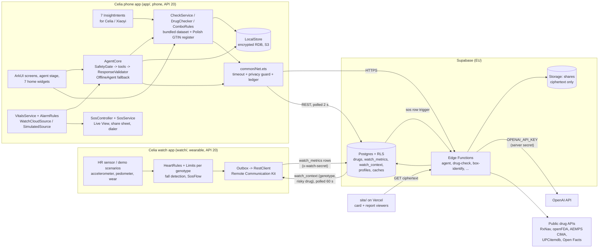

# Architecture

Celia.ai is a native HarmonyOS (ArkTS + ArkUI, Stage model, API 20) heart-safety companion for people with Long QT
syndrome. Three parts: a **phone app** (`app/`), a **wearable app** (`watch/`) and a small **Supabase backend**
(`backend/`). Static viewer pages for shared links live in `site/`.

Two design rules shape everything below:

1. **Verdicts are deterministic.** Medicine risk, interactions, heart-rate alarms, SOS escalation and the emergency
   card come from fixed data and pure rules on the device. An LLM may only *explain* a verdict, and every model output
   is validated before it is shown; anything invalid falls back to deterministic text.
2. **Offline first, local first.** The safety core (medicine check, emergency card, profile, medicines, reminders,
   first-responder view) works with no network and no account. Every network path is optional, goes through one
   client (`common/Net.ets`) and is recorded in an on-device privacy ledger.

Product description: [IDEA.md](IDEA.md), [PRODUCT.md](PRODUCT.md). AI features in detail:
[AI_FEATURES.md](../AI_FEATURES.md). How to verify each feature: [README](../README.md#how-to-verify-each-feature-emulator).

## System diagram



No API key for an LLM ships in either app. The phone holds only the Supabase URL and public (anon) key, in the
gitignored `app/entry/src/main/ets/common/LocalConfig.ets` (created from `LocalConfig.example.ets` on first build).
Without it the app runs fully offline.

## Components

### Phone app (`app/entry/src/main/ets/`)

One `UIAbility` (`EntryAbility`, singleton) with a single `Navigation` + `NavPathStack` page (`pages/Index.ets`)
that hosts the tabs (Today, Medicines, agent orb, Health, Emergency) and every pushed route (`common/Routes.ets`).
Plus one `FormExtensionAbility` for widgets and seven InsightIntent entries.

| Folder | Responsibility | Key files |
|---|---|---|
| `agent/` | On-device agent loop, model relay client, tool executors, offline agent, output validation, medicine-photo flow | `AgentCore`, `AgentClient`, `ToolRegistry`, `tools/*`, `ResponseValidator`, `OfflineAgent`, `DrugCheckFlow`, `MedicineScanFlow`, `VerdictText` |
| `safety/` | Pre-LLM emergency filter, deterministic interaction rules, emergency numbers | `SafetyGate`, `ComboRules`, `EmergencyNumbers` |
| `drugs/` | Deterministic medicine check, bundled dataset, barcode and OCR input, online fallbacks | `DrugDataset` (curated list, compiled in), `DrugChecker`, `CheckService`, `BarcodeService`, `Gs1`, `GtinCatalog`, `OcrService`, `DrugCheckClient`, `BoxIdentifyClient`, `MedInfoClient` |
| `vitals/` | Heart-rate sources, genotype alarm rules, trends, health metrics, watch link | `VitalsService`, `AlarmRules`, `WatchCloudSource`, `SimulatedSource`, `WatchContextSync`, `WearNotifier`, `BetaBlockerWatch`, `Metrics`, `Trends` |
| `emergency/` | SOS state machine and side effects, emergency card (QR, NFC, read aloud), first-responder view, Live View, travel and pharmacy card, nearby help | `SosController`, `SosService`, `LiveStatus`, `CardLink`, `CardContent`, `CardSpeech`, `NfcCard`, `Responder`, `TravelService`, `NearbyHelp` |
| `share/` | End-to-end encrypted share links | `ShareCrypto` (AES-256-GCM), `ShareService` |
| `doctor/` | Doctor-visit brief and visit plan (rules only), optional AI summary, redaction | `DoctorPrep`, `VisitPlan`, `Visit`, `VisitStore`, `DoctorSummary`, `Redact`, `ReportPayload` |
| `account/` | Optional Supabase Auth account, profile backup, SOS contacts (consent), push token | `AuthClient`, `Session`, `ProfileSync`, `SosContacts`, `PushToken` |
| `data/` | Encrypted local database, watch pairing, watch history cache, profile photo | `LocalStore`, `WatchPairing`, `WatchDataClient`, `HistoryCache`, `ProfilePhoto` |
| `voice/` | Push-to-talk (on-device or cloud STT/TTS), hands-free realtime voice, demo voice clips | `VoiceSession`, `VoiceInput`, `VoiceOutput`, `RealtimeSession`, `PcmStreamPlayer`, `DemoVoice` |
| `reminders/` | Dose schedule and system reminders | `DoseSchedule`, `ReminderService` |
| `diary/`, `coach/`, `bystander/` | Feeling diary, genotype trigger tips, CPR metronome | `DiaryStore`, `Coach`, `Metronome` |
| `privacy/` | Privacy ledger and personal-field guard | `Ledger` |
| `insightintents/` | System-assistant entry points (see Celia integration) | 7 `*Intent.ets` |
| `widget/`, `entryformability/` | Home and lock-screen cards (Form Kit) | `WidgetSync`, `WidgetSnapshot`, `pages/*Card.ets`, `EntryFormAbility` |
| `model/` | Shared typed contracts (strict ArkTS) | `DrugVerdict`, `AgentTypes`, `Profile`, `Medication`, `Vitals`, `Chat`, `WatchData` ... |
| `pages/`, `components/` | Screens and reusable ArkUI components (design tokens from `resources/base/element/*.json`, [DESIGN.md](design/DESIGN.md)) | |
| `common/` | Networking, notifications, dialer, share sheet, haptics, app lock, motion, logging, config | `Net`, `Notify`, `Dialer`, `Share`, `AppLock`, `Config` |

Bundled resources: `resources/rawfile/gtin_pl.json` (Polish medicines register, about 19k products / 68k packs),
`rawfile/voice/*.pcm` (8 demo voice clips for the emulator, used only when `DEMO_VOICE_INPUT` is on and labelled
`SIMULATED VOICE INPUT`), `rawfile/sos_live.png` (Live View picture). The curated drug list itself is ArkTS source
(`drugs/DrugDataset.ets`), so it cannot fail to load.

### Watch app (`watch/entry/src/main/ets/`)

A standalone HarmonyOS wearable app (`deviceTypes: ["wearable"]`) that runs on the Huawei wearable emulator. Details:
[README: watch app](../README.md#2-watch-app).

| Unit | Does |
|---|---|
| `controller/WatchController` | Facade the screens read; owns the units below |
| `controller/SensorHub` | Heart-rate source (real `HEART_RATE` sensor or demo scenario), accelerometer (rest/active, falls, adaptive 25/10 Hz), pedometer, wear detection |
| `controller/HeartRules` + `vitals/Limits`, `AlarmRules`, `RestingHr`, `RecoveryTracker`, `SleepDetector` | Per-reading rules: limits per state and genotype (tighter after a risky medicine), resting HR, slow recovery, alerts. HRV, SpO2, breathing and irregular rhythm are **simulated inputs** and labelled `SIM` |
| `controller/SosFlow` | Fall "Are you OK?" 30 s, then SOS countdown 10 s, then an `sos` row |
| `controller/SyncEngine` + `sync/MetricOutbox`, `RestClient`, `SupabaseUploader` | Persistent outbox, batched uploads to `watch_metrics`, one Remote Communication Kit session |
| `controller/PairingFlow` + `sync/PairingClient`, `DeviceIdStore` | 6-digit pairing code; stores the device id and the watch secret |
| `sync/PatientContextClient` | Polls `watch_context` every 60 s (genotype, last risky medicine, alert acknowledgement) |
| Screens (`components/`) | Home ring, 10-min heart, vitals, log (symptoms, dose taken, SOS), settings, alert / check-in / SOS / drug-verdict / dose-nudge glances, simulator panel (`DEMO_MODE` builds only) |

The phone and watch emulators cannot see each other over Bluetooth, and Wear Engine is not available to us (see
Kits), so the link is a **cloud relay** through Supabase: the watch writes rows, the phone polls them.

### Backend (`backend/supabase/`)

Edge Functions (Deno, TypeScript). Shared code in `functions/_shared/` (`prompt.ts` system prompt + `PROMPT_VERSION`,
`tools.ts` tool schemas, `openai.ts`, `rxnav.ts`, `openfda.ts`, `labelRisk.ts`, `gtin.ts`, `validate.ts`). Contracts:
[README: backend](../README.md#3-backend-supabase).

| Function | One line | LLM? |
|---|---|---|
| `agent` | One model step of the agent loop (OpenAI Responses API, 18 tool schemas). Stateless relay; tools run on the phone | Yes |
| `realtime-session` | Mints a short-lived OpenAI Realtime client secret with the same instructions and tools | Yes |
| `transcribe` | Push-to-talk speech-to-text fallback (WAV in, text out), biased to medicine names | Yes |
| `speak` | Text-to-speech fallback (PCM 24 kHz) for replies and the card read-aloud in non-English languages | Yes |
| `vision-extract` | Box photo -> medicine **names only** with confidence; never judges risk | Yes |
| `drug-check` | Deterministic QT verdict: curated list, then RxNav ingredient + openFDA label QT rule; cached 30 days in `label_cache` | No |
| `box-identify` | Unknown barcode -> brand + English ingredients (cache, registries, product DBs; AI web search last, shared only after 2 device confirmations). Never a verdict | Last resort only |
| `med-info` | Plain-language explanation of a medicine; replies mentioning QT, arrhythmia or doses are dropped | Yes |
| `doctor-summary` | 2-3 sentence summary atop the deterministic doctor brief; reassurance, doses or start/stop advice are dropped | Yes |
| `share` | Stores and serves end-to-end encrypted card / report blobs (ciphertext only, private `shares` bucket), revoke, 48 h report expiry, rate limit | No |
| `sos` | Called by a DB trigger on a watch `sos` row: cooldown + global cap, Huawei Push to the owner's phone, deterministic SMS + call to consented contacts via Twilio, audit in `sos_dispatches`. Dry run without secrets | No |

Database (`migrations/`, applied to project `jxiggumhircfuhianmel`, see [handoff/B_DEPLOY.md](handoff/B_DEPLOY.md)):

- `drugs`, `drug_aliases` (same curated data as the app, `seed.sql`), `label_cache`, `box_cache`, `box_confirmations`.
- Watch: `watch_metrics` (one generic table keyed by `type`), `watch_context`, `watch_pairings`, read-only daily
  views for the phone (`watch_vitals_daily`, resting HR, insights), demo RPCs, 60 days of labelled simulated history
  for the demo device.
- Accounts: `profiles` (one JSON document per user), `push_tokens`, `emergency_contacts` (consented, max 5),
  `sos_dispatches`.
- RLS: `profiles` and `push_tokens` are `auth.uid() = user_id`. Watch data is readable only by the account bound to
  the watch at pairing time; watch writes need the per-watch secret (`x-watch-secret`, only its SHA-256 is stored).
  The shared demo device `demo-watch-1` (simulated data) stays public on purpose. `backend/supabase/tests/run-rls.sh`
  checks the account policies on a throw-away Postgres.

Evaluation scripts (`backend/eval/`): agent, voice, vision evals, a remote smoke test of every deployed function and
a local dev backend.

### Data pipeline (`data/`)

The app's sources are the single source of truth; scripts generate everything else.

| Script | Produces |
|---|---|
| `export_seed.py` | `backend/supabase/seed.sql` from `drugs/DrugDataset.ets` (online and offline checks use the same list) |
| `export_gtins.py` | `rawfile/gtin_pl.json` from the public Polish medicines register (URPL) |
| `export_card_site.py` | `site/card/data.js` (card strings, 13 languages) from the app's own sources |
| `demo_history.py` | 60-day simulated history: `vitals/DemoHistoryData.ets` and the `demo_history` migration |

### Viewer pages (`site/`, Vercel)

Static pages, no data stored: `site/card/` (emergency card) and `site/report/` (doctor report) decrypt the blob in the
browser with WebCrypto using the key from the URL `#fragment`. Strict CSP (`connect-src` only the Supabase project),
`no-referrer`, `noindex`. They are static because Supabase serves Edge Function HTML as `text/plain`.
`site/index.html` is the landing page.

## Key data flows

### 1. Medicine check (type, scan, photo)

```
typed name ─┐
barcode ────┼─► Scan Kit → GS1 parse → taught boxes → gtin_pl.json → demo codes ──(unknown)─► /box-identify (user confirms)
photo ──────┘   Core Vision OCR on device ──(nothing recognised)─► /vision-extract (names only, user confirms)
                    │
                    ▼  ingredient name(s)
          CheckService → DrugChecker (bundled list, every token, worst risk wins, unknown token → UNKNOWN_DRUG)
                    │                         └─(unknown and backend configured)─► /drug-check (5 s timeout,
                    │                            list → RxNav → openFDA label rule; confidence capped at 0.9)
                    ▼
          ComboRules vs. my medicines (ADDITIVE_QT, CYP_INHIBITION, MANY_QT_DRUGS → escalate one level)
                    ▼
          DrugVerdict + "How we know" trace → VerdictCard, history (scans table), watch_context if risky
                    ▼  (optional, online)
          /med-info "Explain it in plain words" → validated, shown as AI SUMMARY, never changes the badge
```

Risk levels: `KNOWN_RISK`, `POSSIBLE_RISK`, `CONDITIONAL_RISK`, `NOT_LISTED`, `UNKNOWN_DRUG`. "Safe" is never an
output. The chat (`check_drug` tool), the check screen, the widget and the `CheckDrugSafety` intent all go through
the same path (`agent/DrugCheckFlow.ets`), so they cannot disagree.

### 2. Agent turn

```
text / speech ─► SafetyGate (regex, EN + PL) ──EMERGENCY──► deterministic emergency reply + 30 s SOS countdown (no LLM)
                    │ OK
                    ▼
     /agent step (context: condition, genotype, medicine ingredients, one-line vitals digest, emergency number,
                  locale + last 12 messages) ── 20 s timeout
                    │ tool calls?
                    ▼
     ToolRegistry runs them ON THE PHONE ─► outputs back to /agent (≤ 5 steps per turn)
                    │ final text
                    ▼
     ResponseValidator.checkFinalText: reassures about a risky verdict / downplays it → replaced by deterministic text
                    ▼
     AgentReply {text, actions[], fallback} → AgentThread cards; saved to the open chat (LocalStore)

     any failure (offline, timeout, non-200, bad JSON) ─► OfflineAgent (pattern-based, same tools) with fallback: true
```

- 18 tools: `check_drug`, `get_my_meds`, `suggest_alternatives`, `explain_condition`, `get_vitals_summary`,
  `scan_medicine`, `add_med`, `show_emergency_card`, `start_emergency`, `share_emergency_card`, `start_new_chat`,
  `log_symptom`, `prepare_doctor_visit`, `get_dose_status`, `get_trends`, `open_symptom_log`, `open_reminders`,
  `log_dose`. Schemas: `backend/supabase/functions/_shared/tools.ts`; executors: `agent/tools/`. A unit test fails
  if the two lists drift.
- Write tools (`add_med`, `log_dose`, `share_emergency_card`) only create a confirm card; nothing is written before
  the user taps (pending actions expire after 10 minutes). `log_symptom` writes to the on-device log directly, and its
  red-flag symptoms start SOS by rule, not by the model.
- Follow-up chips after a verdict are chosen by the risk level, not by the model.
- Hands-free voice (`voice/RealtimeSession.ets`): a WebSocket to the OpenAI Realtime API with a 2-minute client secret
  from `/realtime-session`. The same on-device tools run; every input transcript passes SafetyGate (emergency cancels
  the response), and a streaming answer that reassures about a medicine is cancelled and replaced by the deterministic
  verdict.

### 3. Vitals alert -> check-in -> SOS

```
watch HeartRules (on the wrist) ─► watch_metrics row ─► WatchCloudSource (poll 2 s) ─┐
SimulatedSource (labelled SIMULATED) ─► AlarmRules per genotype ─────────────────────┴─► VitalsAlert {kind, severity}
                                                                                              │
   INFO ─► agent message only          WARN ─► check-in sheet "Are you OK?" (I'm OK / I feel unwell)
                                                    │ no answer in 60 s
   CRITICAL (not in cooldown) ───────────────────────┴─► SosController COUNTDOWN 30 s (Live View or ongoing notification)
                                                            │ "I'm OK" → ACKED (also closes the alert on the watch)
                                                            ▼ timeout / Send now
                                                          SENT: location (if allowed) → message via system share
                                                          sheet, call 112 via dialer, call contacts, responder view
```

- Watch SOS: the watch runs its own 10 s countdown and writes an `sos` row; the phone opens "Your watch sent an SOS"
  directly (no second countdown). The DB trigger also calls the `sos` function.
- After SENT, automatic triggers are ignored for 10 minutes; manual SOS and calling are never blocked.
- A third-party app cannot send SMS (`SEND_MESSAGES` is system-only), so the phone hands the deterministic message to
  the share sheet. Server-side SMS/calls to contacts need Twilio secrets, which are not set: the `sos` function records
  a `dry_run` and the Account page says nobody was contacted.
- Missed beta-blocker check (`BetaBlockerWatch`): a rise in daily resting HR becomes a WARN alert and a proactive
  agent message.

### 4. Emergency card share link

```
Profile (minus fields switched off in hiddenOnCard, never the photo) → card JSON v2
   ─► ShareCrypto.seal: fresh AES-256-GCM key (iv | ciphertext | tag)
   ─► POST /share {kind:'card', ciphertext} → {id, revokeToken}
   ─► QR / NFC tag: https://<viewer>/card/#<id>.<key>     (the key after # never reaches any server)
   ─► any phone camera → site/card decrypts in the browser, renders in the reader's language (13), 112 first
```

Offline or without a backend the QR carries the whole card in the `#fragment` (legacy link). Both kinds also open
in Celia's own scanner (`pages/CardViewPage.ets`). "Remove this link" revokes the blob; the link and revoke token
are kept only on the phone. The NFC write (`emergency/NfcCard.ets`) writes the same link as an NDEF URI.

### 5. Doctor visit

```
New visit (kind of doctor, reason, date, worries) → VisitPlan: keyword rules → purposes → drug classes
   → "Please don't prescribe" from the bundled QT list (known risk; possible/conditional folded)
   + DoctorPrep brief: medicines by risk, interactions, flagged checks, heart alerts, symptom counts, genotype watch-outs
   + optional /doctor-summary (non-personal lines only: medicines, risk words, purpose titles) → validated, labelled AI
   → visit page; Share → encrypted report link (kind 'report', expires in 48 h) on site/report
```

Visits are stored as JSON in the encrypted RDB. The typed reason and worries never leave the phone from the visit
page; `doctor/Redact.ets` exists as a second line of defence (profile names, numbers, e-mails, links become
`[removed]`, and the server scrubs patterns again).

## HarmonyOS kits used

Every row is an `import ... from '@kit.X'` in the code. "Emulator" says what was actually seen.

### Phone app

| Kit | Used for | Where | Status |
|---|---|---|---|
| Ability Kit | `UIAbility`, `Want` routing, permissions (`abilityAccessCtrl`), `WantAgent` for notification buttons, **InsightIntent** entries for Celia | `entryability/`, `insightintents/`, `onboarding/Permissions.ets`, `common/Notify.ets` | Works; intent routing from Celia needs a real device with Celia/Xiaoyi |
| ArkUI | Declarative UI, `Navigation`, `window` (system bars), `promptAction`, built-in `QRCode` | `pages/`, `components/`, `common/Screen.ets` | Works |
| ArkData | `relationalStore` encrypted RDB (`encrypt: true`, S3); `preferences` for widget snapshots; `uniformTypeDescriptor` for sharing | `data/LocalStore.ets`, `widget/WidgetData.ets`, `common/Share.ets` | Works |
| ArkTS | `util` (base64, text decoding) | `drugs/GtinCatalog.ets`, `voice/*`, `agent/MedicineScanFlow.ets` | Works |
| Network Kit | `http` for every backend call (one place: `common/Net.ets`), `webSocket` for realtime voice | `common/Net.ets`, `agent/BackendClient.ets`, `account/*`, `voice/RealtimeSession.ets` | Works |
| Form Kit | 7 home widgets (agent, dose, heart, check, feeling, alert, medical ID with `autoColor` for the lock screen) | `entryformability/`, `widget/` | Home cards work; lock-screen placement unverified (emulator has no lock-screen editing) |
| Scan Kit | System barcode scanner (camera or album), no camera permission needed | `drugs/BarcodeService.ets` | Works (album path on the emulator) |
| Core Vision Kit | On-device text recognition on box photos; the photo stays on the phone | `drugs/OcrService.ets` | Falls back to `/vision-extract` when unavailable |
| Camera Kit | `cameraPicker` for the agent's "photo of a box" | `pages/AgentPage.ets` | Camera capture unverified (gallery fallback seen) |
| Media Library Kit | Photo picker (box photo, profile photo) | `pages/AgentPage.ets`, `data/ProfilePhoto.ets` | Works |
| Image Kit | Decode and downscale photos before OCR or upload | `drugs/OcrService.ets`, `agent/MedicineScanFlow.ets`, `data/ProfilePhoto.ets` | Works |
| Core File Kit | `fileIo` for the profile photo and picked images | `data/ProfilePhoto.ets`, `pages/AgentPage.ets` | Works |
| Core Speech Kit | On-device speech recognition and text-to-speech (push-to-talk, card read-aloud) | `voice/VoiceInput.ets`, `voice/VoiceOutput.ets` | en-US on-device unverified; cloud `/transcribe` + `/speak` fallback |
| Audio Kit | `AudioCapturer` (mic PCM) and `AudioRenderer` (streamed PCM playback) | `voice/*` | Works |
| Notification Kit | Alerts, SOS countdown, dose notifications, separate emergency category | `common/Notify.ets` | Works; notification buttons not drawn on the emulator |
| Live View Kit | SOS countdown on the lock screen / capsule with a system timer | `emergency/LiveStatus.ets` | Runs on the emulator; real phones need AGC approval (Chinese mainland), falls back to an ongoing notification |
| Background Tasks Kit | `reminderAgentManager` dose reminders | `reminders/ReminderService.ets` | System refuses (1700002) until the AGC quota is granted; in-app notification fallback |
| Location Kit | Location for the SOS message; reverse geocoding for travel mode (country only, nothing uploaded) | `emergency/SosService.ets`, `emergency/TravelService.ets` | Permission flow works; the emulator has no fix ("location unknown") |
| Telephony Kit | `call.makeCall` opens the dialer for 112 and contacts | `common/Dialer.ets` | Works |
| Share Kit | System share sheet for the SOS message, links and report text | `common/Share.ets` | Works |
| Localization Kit | `i18n` system region for the local emergency number | `safety/EmergencyNumbers.ets`, `common/EmergencyNumbers.ets` | Works |
| Crypto Architecture Kit | AES-256-GCM for share links; random challenge for app lock | `share/ShareCrypto.ets`, `common/AppLock.ets` | Works (unit tested, WebCrypto compatible) |
| User Authentication Kit | Optional app lock (face, fingerprint, PIN) | `common/AppLock.ets` | Needs a screen lock on the device |
| Connectivity Kit | NFC reader mode + NDEF write of the card link | `emergency/NfcCard.ets` | Built, unverified; hidden on the emulator (no NFC) |
| Push Kit | Push token so a watch SOS can reach the owner's phone | `account/PushToken.ets` | Built, unverified: emulator gets no token (no AGC project); Chinese-mainland phones only |
| Sensor Service Kit | `vibrator` haptics (alerts, CPR metronome) | `common/Haptics.ets` | Works |
| Accessibility Kit | System "reduce animations" setting (API 23+; animation scale on API 20-22) | `common/Motion.ets` | Read path runs; never seen switched on |
| Basic Services Kit | `BusinessError`, `deviceInfo`/`settings` (animation scale), `pasteboard` | several | Works |
| Performance Analysis Kit | `hilog` logging, including every agent fallback with its reason | `common/Logger.ets` | Works |

Considered and not used: **Wear Engine** (phone-watch link) is limited to phones in the Chinese mainland, needs AGC
approval and has no emulator support, so the watch link is the Supabase relay
([research/phone-watch-link.md](research/phone-watch-link.md)). **Agent Framework Kit** (A2A agent, FunctionComponent)
is not built; Celia integration is through InsightIntents ([research/celia-assistant.md](research/celia-assistant.md)).
**Map Kit / Site Kit** need an AGC key; Nearby help opens a map search URL instead and sends no location.
**Account Kit** (HUAWEI ID) is researched, not built ([research/account-kit.md](research/account-kit.md)).

### Watch app

| Kit | Used for | Where |
|---|---|---|
| Sensor Service Kit | Heart rate (`READ_HEALTH_DATA`), accelerometer, pedometer, wear detection, vibration | `controller/SensorHub.ets`, `vitals/SensorHeartRateSource.ets`, `vitals/ContextSensors.ets` |
| Remote Communication Kit | One `rcp` session for uploads, context polls and RPCs (shared connection pool and TLS) | `sync/RestClient.ets` |
| ArkData | `preferences` for the outbox, device id + watch secret, dose log | `sync/PreferencesOutboxStore.ets`, `sync/DeviceIdStore.ets`, `sync/DoseStore.ets` |
| Notification Kit, Background Tasks Kit | Watch notifications for alerts; daily medication reminder | `common/Notifier.ets` |
| Location Kit | Location in the `sos` row when allowed | `sync/SosLocation.ets` |
| Ability Kit, ArkUI, ArkTS, Basic Services, Performance Analysis | Ability, UI, utils, errors, `hilog` | throughout |

### Celia (system assistant) integration

Seven `@InsightIntentEntry` intents (`resources/base/profile/insight_intent.json`), all deterministic, no LLM:
`CheckDrugSafety` (runs in the background and answers without opening the app), `ShowEmergencyCard`,
`ReadEmergencyCard`, `ShowPharmacyCard`, `LogSymptom`, `TakeDose`, `AddMedication`. Built and compiled; routing from
Celia needs a real device with Celia/Xiaoyi. Inside the app the agent is the centre of the UI (orb tab, agent stage,
agent line on Today, agent widget).

## Permissions

| Permission | App | Why | Type |
|---|---|---|---|
| `INTERNET` | phone, watch | Optional backend calls; watch uploads | system grant |
| `VIBRATE` | phone, watch | Alert haptics, CPR metronome | system grant |
| `NFC_TAG` | phone | Write the card link to an NFC sticker | system grant |
| `PUBLISH_AGENT_REMINDER` | phone, watch | Dose reminders via `reminderAgentManager` | system grant |
| `ACCESS_BIOMETRIC` | phone | Optional app lock | system grant |
| `APPROXIMATELY_LOCATION` + `LOCATION` | phone, watch | Location in the SOS message (optional; SOS works without it); travel-mode country on the phone | user grant, in use, asked in onboarding step 7 with its reason |
| `MICROPHONE` | phone | Voice to the agent | user grant, in use, asked when needed |
| `ACCELEROMETER` | watch | Rest/active state, fall detection | system grant |
| `ACTIVITY_MOTION` | watch | Step counter | user grant |
| `READ_HEALTH_DATA` | watch | Heart-rate sensor | user grant |

No camera permission: Scan Kit and the camera picker run in system UI. Notifications are requested once in
onboarding, never at launch.

## Storage and privacy

| Data | Where | Protection |
|---|---|---|
| Profile, medicines, events, scans, chats, visits, diary, settings, session token, history cache | `celia.db` relational store on the phone | `encrypt: true`, security level S3; optional app lock |
| Profile photo | 512 px JPEG in the app's `filesDir` | Never synced, never on the web card |
| Emergency card / doctor report shares | Supabase Storage `shares` | Ciphertext only; AES key only in the link fragment |
| Account backup (optional) | `profiles` row (one JSON document) | RLS owner-only; last write wins; deletable from Settings |
| SOS contacts (optional, off by default) | `emergency_contacts` | Consent switch; owner-only RPC; readable only by the `sos` function; off deletes them |
| Watch readings | `watch_metrics` | Readable only by the owning account; writes need the watch secret |
| Agent context, voice, photos (online only) | OpenAI via our Edge Functions | No name, contacts or notes; key is a server secret |

Privacy guard (`privacy/Ledger.ets`): every request records time, endpoint, field **names** and size (never values),
viewable and exportable in Settings, Privacy, "What left my phone". Requests whose fields include `name`, `phone`,
`email`, `contacts`, `notes`, location and similar are refused before sending, unless they name one of three
exceptions: `ACCOUNT_AUTH`, `PROFILE_SYNC`, `SOS_CONTACTS`. The full table of what leaves the phone is in the
[README](../README.md#privacy-what-leaves-the-phone). The watch app has no ledger of its own.

## Safety design

- Verdict = `DrugChecker` + `ComboRules`. The model only explains; `ResponseValidator` replaces text that reassures
  about or downplays a risky verdict of the same turn.
- Unknown input is `UNKNOWN_DRUG`, never "safe". A recognised harmless word never hides an unknown or risky one
  (worst risk wins). Typo matching only for long words with exactly one close ingredient.
- Emergency words go to the deterministic emergency path before any model call (typed, push-to-talk and realtime
  transcripts).
- OCR, the vision model and AI box identification only read names; the user confirms before a check runs.
- Write actions need a confirm tap. Red-flag symptoms and unanswered check-ins start SOS by rule.
- Online AI replies (`med-info`, `doctor-summary`) are validated on the server and again on the phone (types, lengths,
  banned words); failures are dropped and the curated content stays.
- Simulated data (heart, HRV, SpO2, voice input, demo history) is always labelled on screen.
- The first-responder view and the card work with no network and honour `hiddenOnCard`; they stay reachable from
  the app lock screen.

## Error handling and offline modes

| Situation | Behaviour |
|---|---|
| No backend configured / offline | Bundled drug list, offline agent, local card link, simulated heart source, on-device voice where available |
| `/drug-check` slow or failing | 5 s timeout; the offline verdict stands (server answers `UNKNOWN_DRUG` by 4.3 s and finishes the lookup into its cache) |
| `/agent` timeout (20 s), non-200, bad JSON, contradiction | `OfflineAgent` reply with `fallback: true`, logged with the reason |
| Unknown tool or bad arguments from the model | Error result returned to the model; never throws |
| OCR unavailable | Downscaled photo to `/vision-extract`; offline, "type the name" |
| Unknown barcode | `/box-identify` fast, then deep; else "teach this barcode" stored on the phone |
| Live View or reminder agent refused | Ongoing notification / in-app notification fallback |
| No location fix | SOS message says "location unknown" |
| Expired session offline | Stays signed in; refreshes when possible; only a rejected refresh token signs out |
| Twilio / Push secrets missing | `sos` function records `dry_run` / `no_account_binding` and the UI says so |

## Testing

| Suite | Command | Covers |
|---|---|---|
| Phone unit tests (Hypium, no device) | `app/scripts/test.sh` | Drug data and checker, interactions, agent safety gate, validator, tool registry, offline agent, chats, alarm rules, SOS state machine, share crypto and links, doctor brief and redaction, accounts, onboarding, widgets and more (`app/entry/src/test/`, 41 files). Network is off (`Config.forceOffline`) |
| Watch unit tests | `cd watch && source env.sh && hvigorw test -p module=entry -p coverage=false --no-daemon` | Limits, alarm rules, motion and falls, SOS flow, pairing, outbox, sync engine, controller |
| Backend unit tests | `npx -y deno test --no-lock backend/supabase/functions/` | Label rule, RxNav/openFDA tier 2, share, SOS message and push sender, box identify, med-info and doctor-summary guards |
| RLS | `backend/supabase/tests/run-rls.sh` | Account policies on a throw-away Postgres |
| Live smoke / evals | `backend/eval/remote-smoke.ts`, `agent-eval.ts`, `vision-eval.ts`, `audio-eval.ts` | Deployed functions end to end; agent and model behaviour |
| On device | `app/scripts/run.sh`, `watch/scripts/run.sh` | Build, install, launch, screenshot on the emulators |

Current counts and what was verified on screen: [README](../README.md#how-to-verify-each-feature-emulator).

## Repo layout

```
Celia.ai/
├─ README.md, AI_WORKFLOW.md, AI_FEATURES.md
├─ app/                        phone app (DevEco project, API 20)
│  ├─ entry/src/main/ets/      folders as in "Phone app" above
│  ├─ entry/src/main/resources/ base/element (design tokens), base/profile (pages, form_config,
│  │                            insight_intent), rawfile (gtin_pl.json, voice/, sos_live.png)
│  ├─ entry/src/test/          local unit tests;  entry/src/ohosTest/ device test harness
│  └─ scripts/                 test.sh, run.sh, device.sh, emu.sh, ui.sh, serve-card.sh
├─ watch/                      wearable app (DevEco project), README with code map, scripts/run.sh
├─ backend/supabase/
│  ├─ functions/               11 Edge Functions + _shared/
│  ├─ migrations/              schema, RLS, triggers, views, demo history
│  ├─ seed.sql                 generated curated drug list
│  ├─ tests/                   RLS test runner
├─ backend/eval/               evals, smoke tests, local dev backend
├─ data/                       generator scripts (seed, GTIN register, card strings, demo history)
├─ site/                       card/ and report/ viewers, landing page (Vercel)
├─ docs/                       product, design (DESIGN.md), research, hackathon rules, handoff notes
├─ deck/, video/               pitch deck and launch film sources
└─ scripts/                    repo tooling
```

## Conventions

- Strict ArkTS (no `any`, untyped object literals, destructuring, index signatures); minimum and target API 20.
- UI uses the tokens in `resources/base/element/*.json` and [DESIGN.md](design/DESIGN.md).
- No secrets in the repo: `LocalConfig.ets`, `.env*`, signing material are gitignored, and `.githooks/` refuses them.
  The OpenAI key, Twilio and Push credentials are Supabase secrets.
- Third-party and pre-existing components are listed in the README and [AI_WORKFLOW.md](../AI_WORKFLOW.md).
